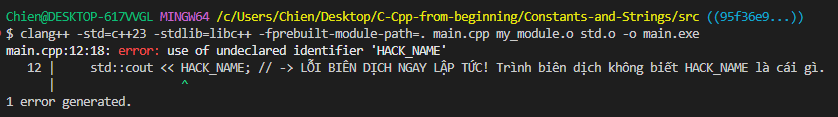

# TỔNG HỢP: HỆ SINH THÁI CÔNG CỤ C++ VÀ KIẾN TRÚC MODULES (C++23)

## PHẦN 1: HỆ SINH THÁI COMPILER & DEBUGGER (Trên MSYS2 UCRT64)

Trong thế giới C++, Trình biên dịch (Compiler) và Trình gỡ lỗi (Debugger) là các công cụ độc lập, được phát triển bởi 2 "Gia tộc" lớn:

### 1. Phe LLVM (Hiện đại, báo lỗi dễ hiểu, hỗ trợ Modules cực tốt)
* **Compiler:** `clang++`
* **Debugger:** `lldb` (LLVM Debugger)
* **Thư viện chuẩn:** `libc++`
* **Lệnh cài đặt trên MSYS2:**
  ```bash
  pacman -S mingw-w64-ucrt-x86_64-clang
  pacman -S mingw-w64-ucrt-x86_64-libc++
  pacman -S mingw-w64-ucrt-x86_64-lldb
  ```

### 2. Phe GNU (Lâu đời, phổ biến nhất, hệ sinh thái khổng lồ)
* **Compiler:** `g++` (thuộc bộ GCC)
* **Debugger:** `gdb` (GNU Debugger)
* **Thư viện chuẩn:** `libstdc++` (Đã được tích hợp sẵn ngầm định, không cần cài rời).
* **Lệnh cài đặt trên MSYS2:** *(Có thể cài chung hoặc tách rời, vì chúng là 2 công cụ độc lập)*
  ```bash
  pacman -S mingw-w64-ucrt-x86_64-gcc mingw-w64-ucrt-x86_64-gdb
  ```

### 3. Tính "Cross-play" (Tương thích chéo)
Khi biên dịch với cờ `-g` (ví dụ: `clang++ -g main.cpp`), trình biên dịch sẽ nhúng một bản đồ gỡ lỗi theo chuẩn quốc tế có tên là **DWARF** vào file `.exe`. Vì cả GDB và LLDB đều tuân theo chuẩn DWARF, bạn hoàn toàn có thể dùng GDB để debug chương trình do Clang tạo ra, hoặc dùng LLDB để soi chương trình của GCC.

---
## PHẦN 2: Lí thuyết (Strict Dependency Isolation).
### A. Vì sao quy trình Modules lại "rườm rà" hơn `#include`?
Người mới thường thắc mắc: *"Tại sao phải gõ tới 4 lệnh phức tạp, tạo ra đủ loại file `.pcm`, `.o` thay vì chỉ 1 lệnh đơn giản như thế giới `#include` cũ?"*

Câu trả lời là **Sự đánh đổi: Trả phí một lần để tận hưởng mãi mãi.**
* **Thế giới cũ (`#include`):** Trình biên dịch phải copy và đọc lại hàng chục ngàn dòng code của thư viện chuẩn vào *từng file mã nguồn* của bạn. Dịch 100 file là đọc lại 100 lần. Quá trình này rất chậm và khiến code dễ bị ô nhiễm bởi rác Macro (`#define`).
* **Thế giới mới (`import`):** Bạn biên dịch mã nguồn (`.cppm`) thành cấu trúc nhị phân (`.pcm`) và mã máy (`.o`) **ĐÚNG 1 LẦN DUY NHẤT**. Từ đó về sau, mọi file gọi lệnh `import` chỉ cần bốc cái khối nhị phân đó nạp thẳng vào RAM siêu tốc. Ranh giới Module cũng sẽ chặn đứng, không cho các Macro rác tràn sang code của bạn.

### B. Từ điển các loại File nguyên liệu
| Loại File | Tên gọi | Bản chất và Vai trò |
| :--- | :--- | :--- |
| **`.cppm`** | File Giao diện Module (Mã nguồn) | Chứa code dạng chữ do người viết. Dùng từ khóa `export` để định nghĩa rõ ràng những gì được phép mang ra ngoài. <br>*(File gốc của hệ thống: `C:/msys64/ucrt64/share/libc++/v1/std.cppm`)* |
| **`.pcm`** | Built Module Interface (Nhị phân) | Được sinh ra từ lệnh `--precompile`. Chứa "Cây cú pháp" đã được phân tích sẵn. Khi code bạn gọi `import`, trình biên dịch sẽ nạp file này để hiểu cấu trúc cực nhanh mà không bị dính Macro rác. |
| **`.o`** | Object File (Mã máy) | Sinh ra từ file `.pcm`. Chứa dải nhị phân (0 và 1) thực thi thực tế của CPU. Nằm chờ Linker gom lại ở bước cuối cùng. |
| **`.exe`** | Executable (File chạy) | Thành phẩm cuối cùng, được trình ghép nối (Linker) "khâu" lại từ tất cả các mảnh file `.o`. |

---
## PHẦN 3: Lí thuyết và nguyên liệu.
Môi trường hiện tại: **Windows + MSYS2 (UCRT64) + Clang 20.1.8**
Thư mục làm việc: `/c/Users/Chien/Desktop/C-Cpp-from-beginning/Constants-and-Strings/src`

**Hệ thống file thư viện:**
* `C:\msys64\ucrt64\bin`: Chứa các trình biên dịch thực thi như `clang++.exe`, `lldb.exe`.
* `C:\msys64\ucrt64\include\c++\15.2.0\bits`: Nơi chứa các file header truyền thống (như định nghĩa nội bộ `basic_string.h` của GCC).
* `C:\msys64\ucrt64\share\libc++\v1\std.cppm`: File mã nguồn giao diện module `std` nguyên thủy của thư viện `libc++` (LLVM).

### A. Chuẩn bị mã nguồn
**File 1: `my_module.cppm` (Do người lập trình viết)**
```cpp
// --- my_module.cppm (Bản gốc) ---

#define HACK_NAME "Toi la trum" // ĐÂY LÀ MỘT MACRO RÁC CỦA PREPROCESSOR

export module my_module;
import std; 

export void doSomething() {
    // Lập trình viên cố tình dùng Macro nội bộ trong thư viện của họ
    std::string hidden_str = "Toi dung string am tham " + std::string(HACK_NAME);
}
```

**File 2: `my_module.cppm` (Trạng thái trung gian: Sau khi Preprocessor chạy)**
```cpp
// --- Trạng thái code sau khi Preprocessor xử lý ---
// (Dòng #define đã bị tiền xử lý dọn dẹp sau khi làm xong nhiệm vụ)

export module my_module;
import std; 

export void doSomething() {
    // Chữ HACK_NAME đã bị thay thế cứng thành giá trị thực tế TRƯỚC KHI đem đi dịch
    std::string hidden_str = "Toi dung string am tham " + std::string("Toi la trum");
}
```
**File 3: `main.cpp` (Người tiêu thụ:)**  
```cpp
// --- main.cpp ---

import my_module; // Nạp file giao diện my_module.pcm
import std; 

int main() {
    // 🟢 GỌI HÀM THÀNH CÔNG: 
    // Hàm này chạy bình thường vì nội bộ nó đã được dịch sẵn chữ "Toi la trum" trong file my_module.o
    doSomething(); 
    
    // =========================================================
    // 🔴 KỊCH BẢN 1: NẾU Ở THẾ GIỚI MỚI (import my_module;)
    // =========================================================
    // Dòng dưới đây sẽ BÁO LỖI BIÊN DỊCH NGAY LẬP TỨC!
    // Lý do: File my_module.pcm không hề chứa thông tin gì về HACK_NAME.
    // Bức tường Module đã chặn thành công rác Macro tràn vào main.cpp.
    
    std::cout << HACK_NAME << '\n'; 


    /* =========================================================
       🟡 KỊCH BẢN 2: NẾU LÀ THẾ GIỚI CŨ (#include "my_module.h")
       =========================================================
       Giả sử dòng trên cùng của file này là #include "my_module.h" (chứa #define HACK_NAME).
       Khi đó, Trình tiền xử lý lại dán cái #define đó thẳng vào main.cpp.
       
       Dòng code này sẽ CHẠY THÀNH CÔNG và in ra "Toi la trum".
       Hậu quả: main.cpp đã bị ô nhiễm bởi một Macro từ file khác rò rỉ sang, 
       bạn vĩnh viễn không thể đặt tên biến nào là HACK_NAME trong main.cpp được nữa.
    */
    
    return 0;
}
```
## PHẦN 4: THỰC HÀNH C++23 MODULES TOÀN TẬP BẰNG CLANG
## 🔩 Quy trình biên dịch 4 lệnh 
Môi trường: **Windows + MSYS2 (UCRT64) + Clang 20.1.8**  
Thư mục làm việc: `/c/Users/Chien/Desktop/C-Cpp-from-beginning/Constants-and-Strings/src`  
*(Dùng lệnh `cd` để đi đến thư mục chứa code trước khi chạy)*  
**1. Khởi tạo Module `std` từ hệ thống (Chỉ làm 1 lần cho mỗi dự án)**
```bash
# Bước 1.1: Lấy file std.cppm của hệ thống, dịch thành Cây cú pháp nhị phân std.pcm
clang++ -std=c++23 -stdlib=libc++ --precompile C:/msys64/ucrt64/share/libc++/v1/std.cppm -o std.pcm

# Bước 1.2: Lấy file std.pcm vừa tạo, dịch thành mã máy std.o
clang++ -std=c++23 -stdlib=libc++ -c std.pcm -o std.o
```

**2. Khởi tạo Module tự viết (`my_module.cppm`)**
```bash
# Bước 2.1: Dịch code của bạn thành my_module.pcm (Cờ -fprebuilt-module-path=. giúp tìm std.pcm ở thư mục hiện tại)
clang++ -std=c++23 -stdlib=libc++ -fprebuilt-module-path=. --precompile my_module.cppm -o my_module.pcm

# Bước 2.2: Dịch tiếp thành mã máy my_module.o
clang++ -std=c++23 -stdlib=libc++ -fprebuilt-module-path=. -c my_module.pcm -o my_module.o
```

**3. Ghép nối (Link) ra sản phẩm cuối cùng (`main.cpp`)**
```bash
# Lệnh này bảo Clang: Hãy dịch main.cpp, nếu gặp 'import', hãy tìm các file .pcm ở thư mục hiện tại (.). 
# Sau đó, giao cho Linker khâu tất cả mã máy (my_module.o và std.o) lại thành file main.exe
clang++ -std=c++23 -stdlib=libc++ -fprebuilt-module-path=. main.cpp my_module.o std.o -o main.exe
```

**4. Chạy và Gỡ lỗi (Debug)**
* **Chạy chương trình:** `./main.exe`  

* **💡 Gỡ lỗi:** Nếu ở Bước 3 bạn thêm cờ `-g` (ví dụ: `... std.o -g -o main.exe`), trình biên dịch sẽ nhúng bản đồ DWARF vào file `.exe`. Khi đó bạn có thể gỡ lỗi bằng lệnh: `lldb main.exe` hoặc `gdb main.exe`.
