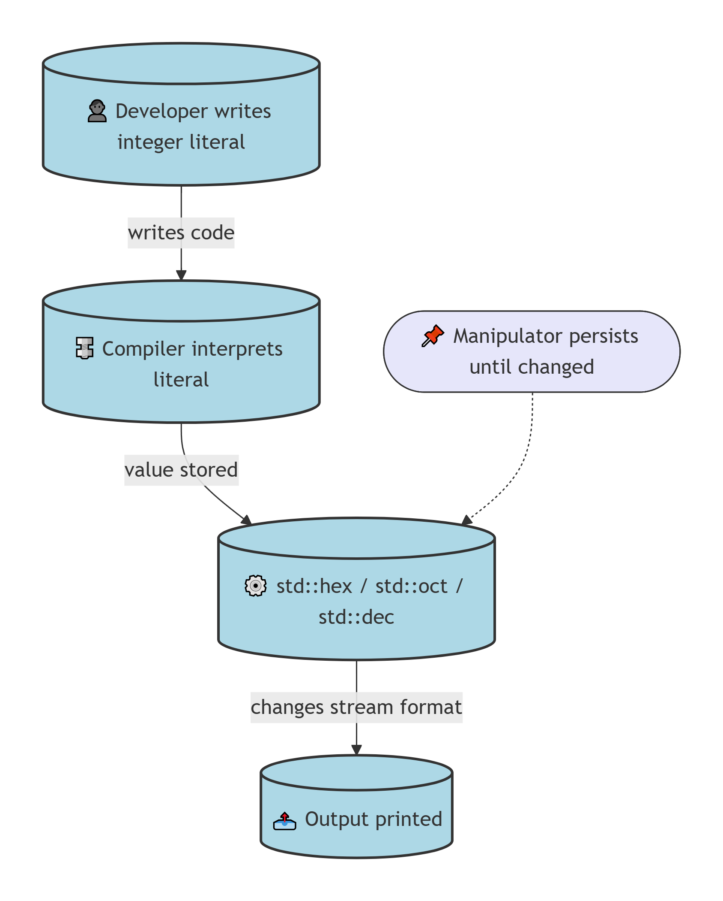
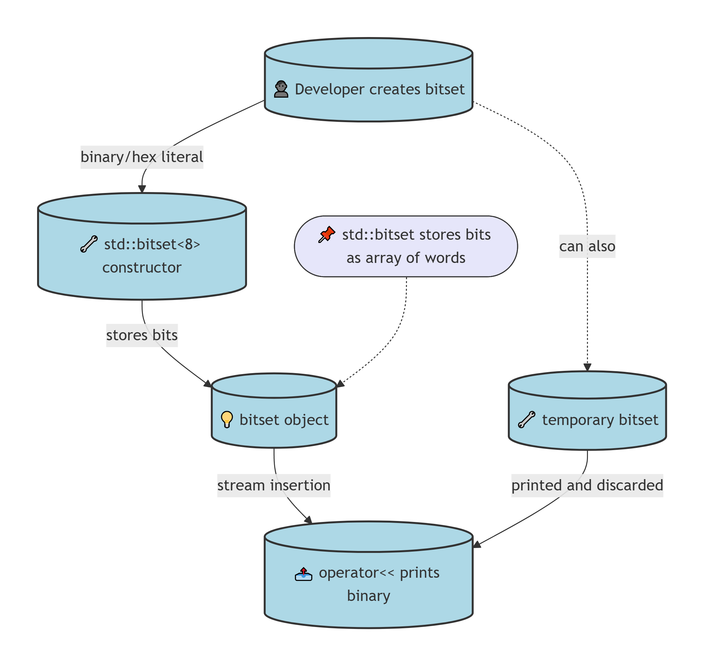
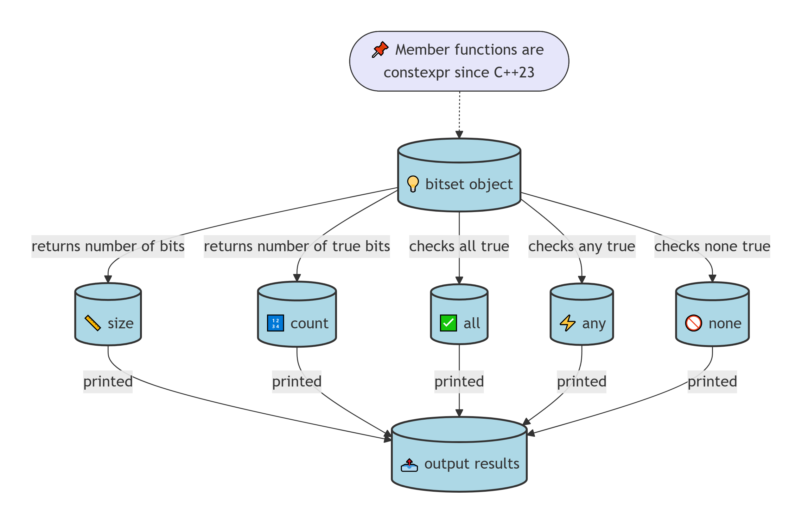
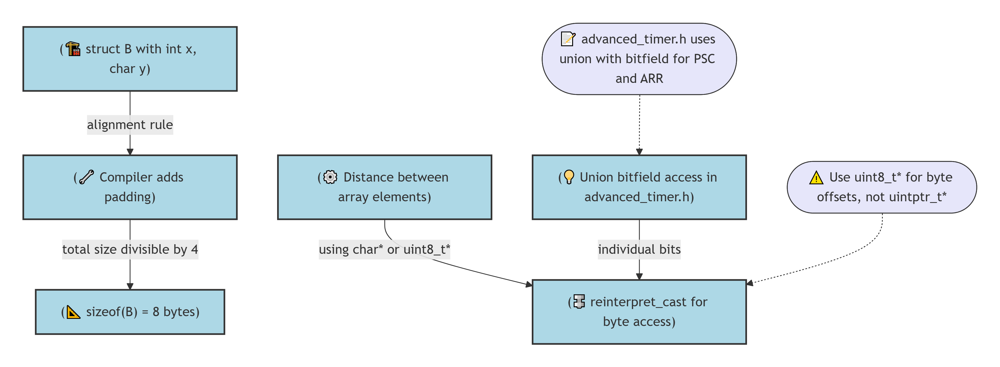
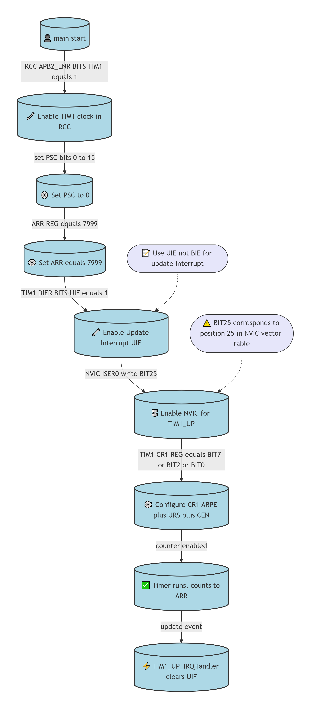
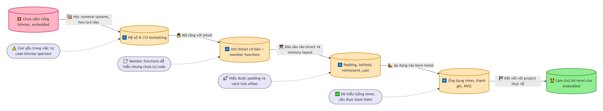

# O.1: Bit Flags and Bit Manipulation via std::bitset
**Làm chủ bit – từ số học cơ bản đến thanh ghi vi điều khiển**
File này ghi lại hành trình học bit manipulation trong C++, bắt đầu từ các hệ số (binary, hex, octal), qua std::bitset, đến các kỹ thuật thao tác bit trên struct và ứng dụng trong embedded (timer STM32). Mục tiêu là hiểu sâu cách biểu diễn và xử lý bit để làm chủ vi điều khiển và firmware.

## BỐI CẢNH HỌC

### Nguồn học
☑ [O.1 — Bit flags and bit manipulation via std::bitset](https://www.learncpp.com/cpp-tutorial/bit-flags-and-bit-manipulation-via-stdbitset/)

### Các bài liên quan
- ☑ [5.3 — Numeral systems (decimal, binary, hexadecimal, and octal] – Keyword: binary, hex, octal, std::bitset – Nắm 95% – Liên quan 10/10
- ☑ [1.4 — Variable assignment and initialization] – Keyword: initialization, list initialization – Nắm 50% – Liên quan 7/10
- ☑ [13.2 — Unscoped enumerations] – Keyword: enum, user-defined type – Nắm 90% – Liên quan 6/10
- ☐ [5.7 — Introduction to std::string] – Keyword: string – Nắm 5% – Liên quan 2/10

### Mục tiêu và phương hướng
- **Chuyên ngành:** Lập trình nhúng (embedded), firmware, Linux embedded, vi điều khiển (STM32, ESP32)
- **Thiết bị / công nghệ:** STM32F103C8T6, ESP32-S3/C3, Raspberry Pi 4; ngôn ngữ C, C++, Python
- **Hướng:** Học tập bổ sung kiến thức lý thuyết, nắm vững căn bản C++ để ứng dụng vào bare-metal và các lớp cao hơn.

### Mức độ hoàn thành file code
- ✓ [bitset.cpp] – 100% tự code – followed 100% – In ra bitset từ binary và hex literal.
- ⚪ [bitset-member_functions.cpp] – 30% tự code – followed 100% – Dùng member functions như size, count, all, any, none.
- ✓ [test_struct_size.cpp] – 100% tự code – followed 100% – Tìm hiểu padding alignment, bitfield, reinterpret_cast, các kiểu uint8_t, uintptr_t.
- ✓ [test-hexadecimal.cpp] – 100% tự code – In số dưới dạng hex.
- ✓ [test-mixed-format.cpp] – 85% tự code – Chuyển đổi định dạng hex, oct, dec.
- ✓ [test-octal.cpp] – 100% tự code – In số dưới dạng octal.

### 2.1. Sợi chỉ đỏ kết nối tất cả các file
Từ các file đơn giản in số dưới dạng hex/oct, đến việc dùng std::bitset để biểu diễn bit, rồi đào sâu vào memory layout (padding) và cách truy cập từng bit trong struct, cuối cùng áp dụng vào cấu hình thanh ghi timer STM32 – tất cả đều xoay quanh việc hiểu và thao tác bit ở mức thấp.

### 2.2. Bảng tổng quan

| Nhóm kỹ thuật | File chính | Kỹ thuật chính |
| :--- | :--- | :--- |
| Hệ số & I/O | test-hexadecimal, octal, mixed-format | std::hex, std::oct, std::dec |
| std::bitset | bitset.cpp, bitset-member_functions.cpp | constructor, size, count, all, any, none |
| Memory layout | test_struct_size.cpp, advanced_timer.h | padding, bitfield, reinterpret_cast, union |
| Ứng dụng embedded | main(10.1).txt, advanced_timer.h | Thanh ghi timer, NVIC, macro |

### 2.3. Liên hệ thực tế với phần cứng
File `advanced_timer.h` định nghĩa cấu trúc thanh ghi TIM1/8 với union và bitfield, giúp truy cập từng bit giống như lập trình thanh ghi trên STM32. File `main(10.1).txt` cấu hình timer, kích hoạt ngắt update và NVIC – đây là mô hình chuẩn của lập trình bare-metal.

## PHẦN 1: KHÁI NIỆM CỐT LÕI

### 3.1. Những điểm còn thiếu / cần bổ sung
Còn yếu trong việc tự viết các bitwise operator, chưa thành thạo các giao thức I2C, USART, chưa nắm vững OOP, design pattern, và chưa biết cách áp dụng Leetcode vào lập trình nhúng.

### 3.2. Bảng các điểm cần bổ sung

| Lĩnh vực | Mô tả |
| :--- | :--- |
| Bitwise operators | Chưa tự code thành thạo, hay dùng AI hỗ trợ |
| Giao thức ngoại vi | Mới học I2C, USART, Timer; cần tìm hiểu SPI, CAN, USB |
| OOP & Design | Thiếu Solid, Design Pattern, Architecture |
| Algorithm | Chưa rõ cách luyện Leetcode để phục vụ embedded |
| Tư duy lập trình | Còn phụ thuộc nhiều vào AI, chưa đọc sách hiệu quả |

### 3.3. Liên hệ thực tế với phần cứng
Việc hiểu rõ padding và bitfield trong `advanced_timer.h` giúp lập trình thanh ghi chính xác trên vi điều khiển, tối ưu bộ nhớ và hiệu năng.

## PHẦN 2: CÁC KỸ THUẬT

### 1. Hệ số và định dạng I/O
Nhóm này thể hiện cách nhập/xuất số ở các cơ số khác nhau trong C++ thông qua manipulator `std::hex`, `std::oct`, `std::dec`.



> **Prompt tạo sơ đồ Định dạng hệ số (dùng cho DeepSeek):**
> ```
> graph TD
>     Dev[(👤 Developer writes integer literal)]:::cylinder
>     Compiler[(🔩 Compiler interprets literal)]:::cylinder
>     Manip[(⚙️ std::hex / std::oct / std::dec)]:::cylinder
>     Output[(📤 Output printed)]:::cylinder
> 
>     Dev -->|writes code| Compiler
>     Compiler -->|value stored| Manip
>     Manip -->|changes stream format| Output
> 
>     Note([📌 Manipulator persists until changed]):::pill
>     Note -.-> Manip
> 
>     classDef cylinder fill:#ADD8E6,stroke:#333,stroke-width:2px
>     classDef pill fill:#E6E6FA,stroke:#333,stroke-width:1px,shape:rounded
>     style Dev rx:0,ry:0
>     style Compiler rx:0,ry:0
>     style Manip rx:0,ry:0
>     style Output rx:0,ry:0
> ```

**Ví dụ thực tế:**
```cpp
// test-hexadecimal.cpp
int x{ 0x3F };
std::cout << x << '\n';  // in ra 63
```
```cpp
// test-mixed-format.cpp
int x { 12 };
std::cout << std::hex << x << '\n';  // in ra c
std::cout << std::oct << x << '\n';  // in ra 14
std::cout << std::dec << x << '\n';  // in ra 12
```
**Ghi chú:**
- `std::hex`, `std::oct` thay đổi định dạng cho toàn bộ stream đến khi gặp `std::dec`.
- Literal `0x3F` là hex, `020` là octal.

---

### 2. std::bitset cơ bản
Sử dụng `std::bitset` để biểu diễn bit, khởi tạo từ binary/hex literal và in ra màn hình.



> **Prompt tạo sơ đồ bitset cơ bản (dùng cho DeepSeek):**
> ```
> graph TD
>     Dev[(👤 Developer creates bitset)]:::cylinder
>     Ctor[(🔧 std::bitset<8> constructor)]:::cylinder
>     BitsetObj[(💡 bitset object)]:::cylinder
>     Print[(📤 operator<< prints binary)]:::cylinder
>     Temp[(🔧 temporary bitset)]:::cylinder
> 
>     Dev -->|binary/hex literal| Ctor
>     Ctor -->|stores bits| BitsetObj
>     BitsetObj -->|stream insertion| Print
>     Dev -.->|can also| Temp
>     Temp -->|printed and discarded| Print
> 
>     Note([📌 std::bitset<N> stores bits as array of words]):::pill
>     Note -.-> BitsetObj
> 
>     classDef cylinder fill:#ADD8E6,stroke:#333,stroke-width:2px
>     classDef pill fill:#E6E6FA,stroke:#333,stroke-width:1px,shape:rounded
>     style Dev rx:0,ry:0
>     style Ctor rx:0,ry:0
>     style BitsetObj rx:0,ry:0
>     style Print rx:0,ry:0
>     style Temp rx:0,ry:0
> ```

**Ví dụ thực tế:**
```cpp
// bitset.cpp
std::bitset<8> bin1{ 0b1100'0101 };
std::bitset<8> bin2{ 0xC5 };
std::cout << bin1 << '\n' << bin2 << '\n';
// in ra: 11000101
//        11000101
```
**Ghi chú:**
- `std::bitset` template parameter là số bit, không phải byte.
- Có thể khởi tạo từ binary literal (C++14) hoặc hex literal.

---

### 3. Member functions của std::bitset
Các hàm thành viên hữu ích để kiểm tra trạng thái của bitset.



> **Prompt tạo sơ đồ bitset members (dùng cho DeepSeek):**
> ```
> graph TD
>     BitsetObj[(💡 bitset object)]:::cylinder
>     Size[(📏 size)]:::cylinder
>     Count[(🔢 count)]:::cylinder
>     All[(✅ all)]:::cylinder
>     Any[(⚡ any)]:::cylinder
>     None[(🚫 none)]:::cylinder
>     Output[(📤 output results)]:::cylinder
> 
>     BitsetObj -->|returns number of bits| Size
>     BitsetObj -->|returns number of true bits| Count
>     BitsetObj -->|checks all true| All
>     BitsetObj -->|checks any true| Any
>     BitsetObj -->|checks none true| None
>     Size -->|printed| Output
>     Count -->|printed| Output
>     All -->|printed| Output
>     Any -->|printed| Output
>     None -->|printed| Output
> 
>     Note([📌 Member functions are constexpr since C++23]):::pill
>     Note -.-> BitsetObj
> 
>     classDef cylinder fill:#ADD8E6,stroke:#333,stroke-width:2px
>     classDef pill fill:#E6E6FA,stroke:#333,stroke-width:1px,shape:rounded
>     style BitsetObj rx:0,ry:0
>     style Size rx:0,ry:0
>     style Count rx:0,ry:0
>     style All rx:0,ry:0
>     style Any rx:0,ry:0
>     style None rx:0,ry:0
>     style Output rx:0,ry:0
> ```

**Ví dụ thực tế:**
```cpp
// bitset-member_functions.cpp
std::bitset<8> bits{ 0b0000'1101 };
std::cout << bits.size() << " bits are in the bitset\n";
std::cout << bits.count() << " bits are set to true\n";
std::cout << "All bits are true: " << bits.all() << '\n';
std::cout << "Some bits are true: " << bits.any() << '\n';
std::cout << "No bits are true: " << bits.none() << '\n';
```
**Ghi chú:**
- `count()` trả về số bit 1.
- `all()` chỉ trả về true nếu tất cả các bit là 1.

---

### 4. Padding, bitfield, và truy cập byte
Hiểu về alignment và padding trong struct, cách tính khoảng cách giữa các phần tử mảng, và truy cập từng bit bằng union + bitfield (áp dụng trong `advanced_timer.h`).



> **Prompt tạo sơ đồ alignment và bitfield (dùng cho DeepSeek):**
> ```
> graph TD
>     StructDef[(🏗️ struct B with int x, char y)]:::cylinder
>     CompilerPadding[(🔧 Compiler adds padding)]:::cylinder
>     Size8[(📐 sizeof(B) = 8 bytes)]:::cylinder
>     ArrayCalc[(⚙️ Distance between array elements)]:::cylinder
>     Casting[(🔩 reinterpret_cast for byte access)]:::cylinder
>     BitfieldAccess[(💡 Union bitfield access in advanced_timer.h)]:::cylinder
> 
>     StructDef -->|alignment rule| CompilerPadding
>     CompilerPadding -->|total size divisible by 4| Size8
>     ArrayCalc -->|using char* or uint8_t*| Casting
>     BitfieldAccess -->|individual bits| Casting
> 
>     Note([⚠️ Use uint8_t* for byte offsets, not uintptr_t*]):::pill
>     Note -.-> Casting
> 
>     Note2([📝 advanced_timer.h uses union with bitfield for PSC and ARR]):::pill
>     Note2 -.-> BitfieldAccess
> 
>     classDef cylinder fill:#ADD8E6,stroke:#333,stroke-width:2px
>     classDef pill fill:#E6E6FA,stroke:#333,stroke-width:1px,shape:rounded
>     style StructDef rx:0,ry:0
>     style CompilerPadding rx:0,ry:0
>     style Size8 rx:0,ry:0
>     style ArrayCalc rx:0,ry:0
>     style Casting rx:0,ry:0
>     style BitfieldAccess rx:0,ry:0
> ```

**Ví dụ thực tế:**
```cpp
// test_struct_size.cpp
struct B {
    int x;   // 4 bytes
    char y;  // 1 byte
};  // size = 8 (padding 3 bytes)

B arr[2];
std::cout << "Khoảng cách: " 
          << reinterpret_cast<char*>(&arr[1]) - reinterpret_cast<char*>(&arr[0]) 
          << " bytes\n";  // in ra 8
```
```cpp
// advanced_timer.h (trích đoạn)
union {
    unsigned long REG;
    struct {
        unsigned long b0  : 1;
        unsigned long b1  : 1;
        // ... đến b15
        unsigned long _reserved : 16;
    } BITS;
} PSC;
```
**Ghi chú:**
- Padding giúp CPU truy cập nhanh hơn nhưng tốn thêm bộ nhớ.
- Dùng `reinterpret_cast<char*>` để tính offset byte chính xác.
- Bitfield trong union cho phép đọc/ghi từng bit riêng lẻ.

---

### 5. Ứng dụng: Cấu hình timer trên STM32
Luồng cấu hình TIM1 để tạo ngắt update, minh họa việc thao tác bit trên thanh ghi thực tế.



> **Prompt tạo sơ đồ timer interrupt (dùng cho DeepSeek):**
> ```
> graph TD
>     Main[(👤 main start)]:::cylinder
>     RCC[(🔧 Enable TIM1 clock in RCC)]:::cylinder
>     PSC[(⚙️ Set PSC to 0)]:::cylinder
>     ARR[(⚙️ Set ARR equals 7999)]:::cylinder
>     DIER[(🔧 Enable Update Interrupt UIE)]:::cylinder
>     NVIC[(🔩 Enable NVIC for TIM1_UP)]:::cylinder
>     CR1[(⚙️ Configure CR1 ARPE plus URS plus CEN)]:::cylinder
>     Run[(✅ Timer runs, counts to ARR)]:::cylinder
>     IRQ[(⚡ TIM1_UP_IRQHandler clears UIF)]:::cylinder
> 
>     Main -->|RCC APB2_ENR BITS TIM1 equals 1| RCC
>     RCC -->|set PSC bits 0 to 15| PSC
>     PSC -->|ARR REG equals 7999| ARR
>     ARR -->|TIM1 DIER BITS UIE equals 1| DIER
>     DIER -->|NVIC ISER0 write BIT25| NVIC
>     NVIC -->|TIM1 CR1 REG equals BIT7 or BIT2 or BIT0| CR1
>     CR1 -->|counter enabled| Run
>     Run -->|update event| IRQ
> 
>     Note([⚠️ BIT25 corresponds to position 25 in NVIC vector table]):::pill
>     Note -.-> NVIC
> 
>     Note2([📝 Use UIE not BIE for update interrupt]):::pill
>     Note2 -.-> DIER
> 
>     classDef cylinder fill:#ADD8E6,stroke:#333,stroke-width:2px
>     classDef pill fill:#E6E6FA,stroke:#333,stroke-width:1px,shape:rounded
>     style Main rx:0,ry:0
>     style RCC rx:0,ry:0
>     style PSC rx:0,ry:0
>     style ARR rx:0,ry:0
>     style DIER rx:0,ry:0
>     style NVIC rx:0,ry:0
>     style CR1 rx:0,ry:0
>     style Run rx:0,ry:0
>     style IRQ rx:0,ry:0
> ```

**Ví dụ thực tế:**
```cpp
// main(10.1).txt
RCC.APB2_ENR.BITS.TIM1 = 1;   // cấp xung
TIM1.PSC.BITS.b0 = 0;         // set PSC = 0
TIM1.ARR.REG = 7999;          // set ARR
TIM1.DIER.BITS.UIE = 1;       // enable update interrupt
*((unsigned long*)0xE000E100) = BIT25; // enable NVIC
TIM1.CR1.REG = BIT7 | BIT2 | BIT0; // ARPE, URS, CEN
```
**Ghi chú:**
- `BIT25` là macro cho 1 << 25 (vị trí TIM1_UP trong vector ngắt).
- Phải xóa cờ trong ISR: `TIM1.SR.BITS.UIF = 0`.

## PHẦN 3: SƠ ĐỒ TỔNG QUAN

Hành trình học từ cơ bản đến ứng dụng, theo hướng tuần tự (Hướng A).



> **Prompt tạo sơ đồ Tổng quan (dùng cho DeepSeek):**
> ```
> graph LR
>     Problem[(💥 Chưa nắm vững bitwise, embedded)]:::main
>     V1[(1️⃣ Hệ số and I/O formatting)]:::main
>     V2[(2️⃣ std::bitset cơ bản plus member functions)]:::main
>     V3[(3️⃣ Padding, bitfield, reinterpret_cast)]:::main
>     V4[(4️⃣ Ứng dụng timer, thanh ghi, NVIC)]:::main
>     Goal[(🏆 Làm chủ bit-level cho embedded)]:::main
> 
>     Problem -->|📦 Học numeral systems, hex/oct/dec| V1
>     V1 -->|🔓 Mở rộng với bitset| V2
>     V2 -->|✂️ Đào sâu vào struct và memory layout| V3
>     V3 -->|📐 Áp dụng vào bare-metal| V4
>     V4 -->|🏁 Kết nối với project thực tế| Goal
> 
>     N1([⚠️ Còn yếu trong việc tự code bitwise operator]):::pill
>     N1 -.-> V1
> 
>     N2([📝 Member functions dễ hiểu nhưng chưa tự code]):::pill
>     N2 -.-> V2
> 
>     N3([🚀 Hiểu được padding và cách tính offset]):::pill
>     N3 -.-> V3
> 
>     N4([✅ Đã hiểu luồng timer, cần thực hành thêm]):::pill
>     N4 -.-> V4
> 
>     classDef main fill:#FFE4B5,stroke:#CC8B00,stroke-width:2px
>     classDef pill fill:#E6E6FA,stroke:#333,stroke-width:1px,shape:rounded
>     style Problem fill:#FFB6C1,stroke:#C71585
>     style Goal fill:#90EE90,stroke:#2d8a2d
> ```

## BẢNG TRA CỨU NHANH

| Mục tiêu | Syntax / Hàm | Ví dụ nhanh | Ghi chú |
| :--- | :--- | :--- | :--- |
| In hex | `std::hex` | `std::cout << std::hex << 63;` | Ảnh hưởng đến stream |
| In octal | `std::oct` | `std::cout << std::oct << 12;` |  |
| In decimal | `std::dec` | `std::cout << std::dec << 12;` |  |
| Khởi tạo bitset | `std::bitset<N> bits{ value };` | `std::bitset<8> bits{0b1100'0101};` | value là unsigned long long |
| Số bit | `.size()` | `bits.size()` | trả về N |
| Số bit 1 | `.count()` | `bits.count()` | O(N) |
| Kiểm tra all/any/none | `.all()`, `.any()`, `.none()` | `if (bits.any()) ...` |  |
| Padding struct | compiler tự thêm | `sizeof(B)` | thành viên lớn nhất quyết định alignment |
| Tính offset byte | `reinterpret_cast<char*>` | `(char*)&arr[1] - (char*)&arr[0]` | kết quả là byte |
| Truy cập bit bằng union | union { REG; struct { bitfield }; } | `PSC.BITS.b0 = 1;` | đọc/ghi từng bit |

## GHI CHÚ CÁ NHÂN

### Điều tôi chưa nắm vững
- Yếu về việc thực hiện các bitwise operator bên C đọc khá khó hiểu. Còn dùng AI để hỗ trợ code nhiều.
- Chỉ mới học được giao thức I2C, USART, TIMER(PWM) và GPIO. Các giao thức khác chưa tìm hiểu qua. Còn dùng AI để code khá nhiều. Chủ yếu là hiểu được luồng làm việc bằng cách nhìn vào datasheet.
- Chưa thấy được mối liên hệ giữa việc học bitwise operator, bare-metal với kiến thức của OOP, Class, Data Structure & Algorithm, Dynamic Programming, Computer Architecture( chỉ mới biết sơ sơ về struct, bitfield, padding,...)
- Chưa tiếp cận với các kiến thức như Solid Design, Design Architecture, Design Pattern,... khiến cho việc mở rộng code trông rất rối và khó bảo trì.
- Chưa biết liệu Leetcode hay Codeforces có hỗ trợ các bài tập liên quan đến lĩnh vực lập trình nhúng này không? Vì tôi thấy nhiều người giới thiệu mà thấy bài tập quá đa dạng nên chưa biết bắt đầu từ đâu.
- Tư duy lập trình còn yếu kém. Chủ yếu học từ learncpp.com bổ sung kiến thức về C++ một cách bài bản nhất.
- Ít đọc sách về lập trình(đã từng đọc sách từ trường đại học, nhưng thấy không vào). Đã từng đọc cuốn sách 'Modern C' của Hal open source và thấy nó khá cuốn ở những chapter đầu tiên(tuy nhiên đọc xong cảm thấy học code không hiệu quả)

### Snippet code / File code tham khảo
- `advanced_timer.h` – định nghĩa cấu trúc thanh ghi TIM1/8 với union và bitfield.
- `main(10.1).txt` – code cấu hình timer và ngắt hoàn chỉnh.

### Bước tiếp theo / Hướng phát triển
Để trống – AI gợi ý:  
- Luyện tập bitwise operators qua các bài tập trên Leetcode (dạng "Single Number", "Number of 1 Bits", "Counting Bits").  
- Viết lại code cấu hình timer mà không dùng AI, tập trung hiểu từng thanh ghi.  
- Bắt đầu nghiên cứu thiết kế OOP cho embedded (ví dụ: lớp Timer, lớp UART).  
- Đọc cuốn "Making Embedded Systems" của Elecia White để có cái nhìn tổng quan.

Thanh tiến độ tổng quan: ████░░░░░░ 40%

### Theo dõi tiến độ bài giảng
- ☑ [O.1 — Bit flags and bit manipulation via std::bitset] – 90% – [link](https://www.learncpp.com/cpp-tutorial/bit-flags-and-bit-manipulation-via-stdbitset/)  
  ██████████░░░░░░░░░░ 50%
- ☑ [5.3 — Numeral systems] – 95% – ████████████████████ 95%
- ☑ [1.4 — Variable assignment] – 50% – ██████████░░░░░░░░░░ 50%
- ☑ [13.2 — Unscoped enumerations] – 90% – ██████████████████░░ 80%
- ☐ [5.7 — Introduction to std::string] – 5% – █░░░░░░░░░░░░░░░░░░░ 5%

### Theo dõi tiến độ file code
- ✓ [bitset.cpp] – 100% tự code – ████████████████████ 100%
- ⚪ [bitset-member_functions.cpp] – 30% tự code – ██████░░░░░░░░░░░░░░ 30%
- ✓ [test_struct_size.cpp] – 100% tự code – ████████████████████ 100%
- ✓ [test-hexadecimal.cpp] – 100% tự code – ████████████████████ 100%
- ✓ [test-mixed-format.cpp] – 85% tự code – ██████████████████░░ 85%
- ✓ [test-octal.cpp] – 100% tự code – ████████████████████ 100%

### Ghi chú tự do
> (Người dùng tự điền)