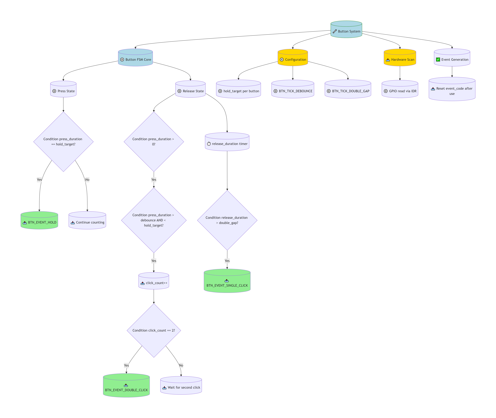
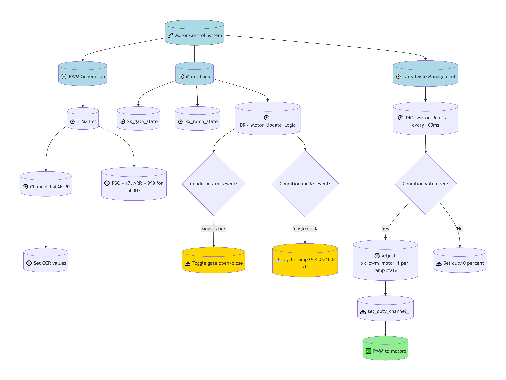
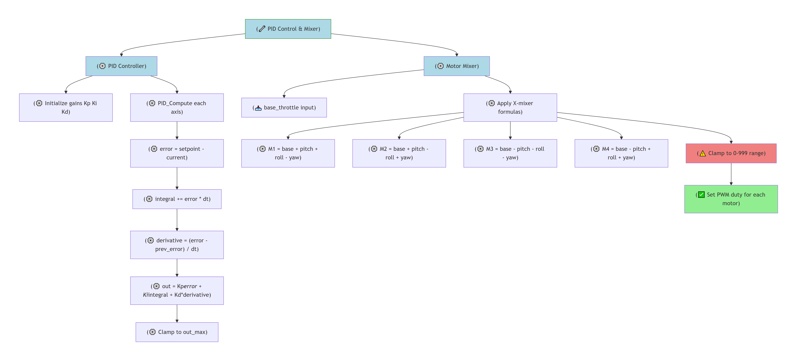
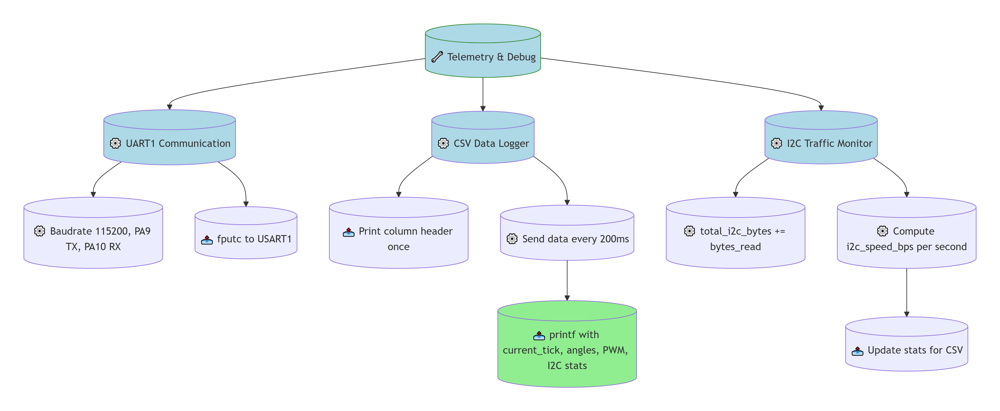
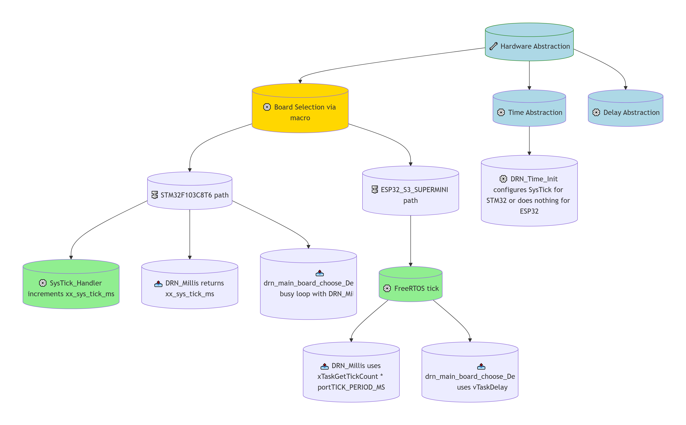
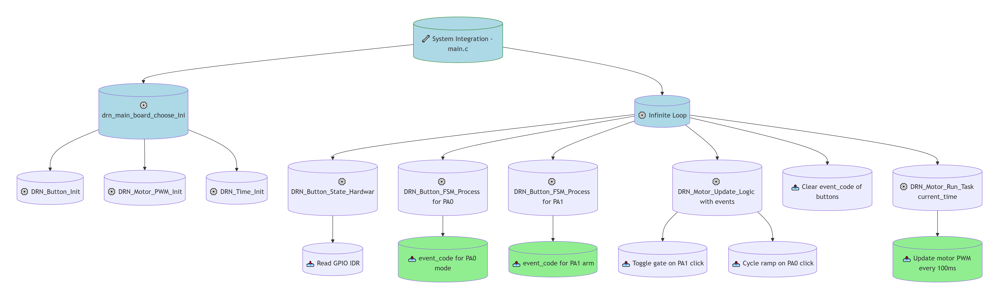
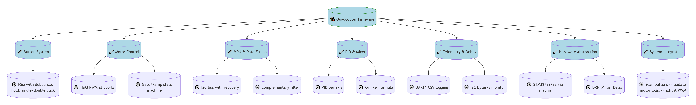

# O.1 — Bit flags and bit manipulation via std::bitset
**Từ bit flags đến hệ thống điều khiển động cơ drone: hành trình từ lý thuyết đến ứng dụng nhúng**
Tài liệu này tổng hợp các kiến thức về thao tác bit, hệ cơ số, cấu trúc struct và alignment, đồng thời đi sâu vào phân tích code điều khiển drone quadcopter dựa trên STM32F103C8T6. Mục tiêu là hệ thống hóa các kỹ thuật lập trình nhúng, từ xử lý nút bấm, PWM điều khiển động cơ, đọc cảm biến MPU6500 qua I2C, đến bộ lọc PID và telemetry.

## BỐI CẢNH HỌC

### Nguồn học
☑ [O.1 — Bit flags and bit manipulation via std::bitset](https://www.learncpp.com/cpp-tutorial/bit-flags-and-bit-manipulation-via-stdbitset/)

### Các bài liên quan
☑ [5.3 — Numeral systems (decimal, binary, hexadecimal, and octal] — binary, hex, octal, std::bitset — 95% nắm — 10/10 liên quan
☑ [1.4 — Variable assignment and initialization] — khởi tạo object, list initialization — 50% nắm — 7/10 liên quan
☑ [13.2 — Unscoped enumerations] — unscoped enum, user-defined type — 90% nắm — 5/10 liên quan
☐ [5.7 — Introduction to std::string] — string, c-string literal — 5% nắm — 2/10 liên quan

### Mục tiêu và phương hướng
- **Chuyên ngành / lĩnh vực:** Lập trình nhúng (embedded), firmware, lập trình vi điều khiển bare‑metal, C++/OOP.
- **Thiết bị / công nghệ:** STM32F103C8T6, ESP32‑S3 Supermini, ESP32‑C3 Supermini; ngôn ngữ C, C++, Python (training AI).
- **Hướng dự án:** Làm dự án drone quadcopter mini, tối ưu hiệu suất xử lý và bay, sau đó mở rộng lên drone lớn hơn. Hiện tại đang test code trên STM32F103C8T6 với bare‑metal.

### Mức độ hoàn thành file code
✓ [bitset.cpp] — followed 100% — tự code 100%, AI 0/10: in ra màn hình giá trị nhị phân.
⚪ [bitset-member_functions.cpp] — followed 100% — tự code 30%, AI 9/10: tích hợp member functions size(), count(), all(), any(), none().
✓ [test_struct_size.cpp] — followed 100% — tự code 100%, AI 0/10: thao tác với bit field, sử dụng uint8_t, uint64_t, uintptr_t, reinterpret_cast, học về padding/alignment.
✓ [test-hexadecimal.cpp] — followed 100% — tự code 100%, AI 0/10: in biến dạng hex.
✓ [test-mixed-format.cpp] — followed 100% — tự code 85%, AI 0/10: in ra các hệ số và mở rộng nhờ AI.
✓ [test-octal.cpp] — followed 100% — tự code 100%, AI 0/10: in giá trị dạng octal.

### 2.1. Sợi chỉ đỏ kết nối tất cả các file
Các file code tập trung vào thao tác bit (std::bitset) và hiểu cấu trúc bộ nhớ (struct padding) làm nền tảng cho việc điều khiển phần cứng ở mức thanh ghi, từ đó xây dựng hệ thống điều khiển drone hoàn chỉnh.

### 2.2. Bảng tổng quan

| Module                | File(s) chính                                     | Chức năng chính                                                                 |
| :-------------------- | :------------------------------------------------ | :------------------------------------------------------------------------------ |
| Button FSM            | button.c, drn_button.c, button.h                  | Đọc nút, FSM phát hiện single/double click, hold                               |
| PWM Motor             | drn_motor_pwm.c, hal_timer_pwm.c, drn_timer_pwm.c | PWM 500Hz (sau 4kHz), điều khiển duty, ramp ga, gate on/off                    |
| MPU6500 & Data Fusion | i2c_mpu_debug.c, xx_mpu_data_fusion.c             | I2C giao tiếp, calibration, complementary filter, tính góc roll/pitch/yaw      |
| PID Control & Mixer   | pid_control.c                                     | PID cho 3 trục, công thức mixer X, xuất duty cho 4 động cơ                     |
| Telemetry & Debug     | telemetry.c                                       | UART1, CSV log, giám sát I2C bytes/s                                           |
| Hardware Abstraction  | drn_main_board_choose.c, drn_time.c, main.c       | Chọn board qua macro, thời gian (SysTick/FreeRTOS), vòng lặp chính             |

### 2.3. Liên hệ thực tế với phần cứng
- **STM32F103C8T6:** Dùng SysTick 1ms, TIM3 PWM 500Hz (sau chuyển lên 4kHz), TIM4 micros cho dt, I2C1 giao tiếp MPU6500, USART1 telemetry.
- **ESP32‑S3 Supermini:** Dự định chuyển sau khi code hoàn chỉnh, sẽ dùng FreeRTOS và LEDC cho PWM.

## PHẦN 1: KHÁI NIỆM CỐT LÕI

### 3.1. Những điểm còn thiếu / cần bổ sung
- Kiến thức phần cứng: đo đạc, tính toán thông số, vẽ PCB, thiết kế 3D.
- Thiết kế app Bluetooth với giao thức BLE để điều khiển qua điện thoại.

### 3.2. Bảng các điểm cần bổ sung

| Kỹ thuật / Kiến thức        | Mức độ hiện tại | Mục tiêu |
| :-------------------------- | :-------------- | :------- |
| Đo và tính toán phần cứng   | 20%             | 80%      |
| Thiết kế mạch PCB           | 10%             | 70%      |
| Thiết kế 3D (khung drone)   | 10%             | 60%      |
| Ứng dụng BLE (app)          | 0%              | 50%      |

### 3.3. Liên hệ thực tế với phần cứng
- **STM32F103C8T6:** Đã hiểu cấu hình timer, I2C, UART qua thanh ghi; cần bổ sung tính toán dòng điện, lựa chọn MOSFET, diode flyback, và thiết kế mạch in để giảm nhiễu.
- **ESP32‑S3:** Sẽ cần tìm hiểu FreeRTOS, LEDC, BLE stack để phát triển app điều khiển.

## PHẦN 2: CÁC KỸ THUẬT

### 1. Hệ thống nút bấm (Button FSM)

Hệ thống nút bấm sử dụng máy trạng thái với thời gian debounce, double‑click và hold. Mỗi nút có thời gian hold riêng (PA0 = 500 nhịp 10ms = 5s; PA1 = 200 nhịp = 2s). FSM chạy mỗi 10ms, sinh sự kiện `SINGLE_CLICK`, `DOUBLE_CLICK`, `HOLD`.



> **Prompt tạo sơ đồ Hệ thống nút bấm (dùng cho DeepSeek):**
> ` ` ` text
> Act as a Senior Embedded Firmware Architect. Generate a Mermaid.js flowchart (Graph TD) illustrating Button FSM with debounce, double‑click detection, and per‑button hold target.
> CRITICAL STYLE REQUIREMENT: Use cylinder shape `NodeID[(Label)]` for all nodes.
> ICON SYSTEM — prepend icon:
> - 🔧 for system/core
> - ⚙️ for processing
> - 📥 for input
> - 📤 for output/event
> - ✅ for final result
> - ⚠️ for warning
> Nodes and Routing:
> 1. `Root[(🔧 Button System)]` connects down to `ButtonFSM[(⚙️ Button FSM Core)]`, `Config[(⚙️ Configuration)]`, `Hardware[(📥 Hardware Scan)]`, `EventGen[(✅ Event Generation)]`.
> 2. `ButtonFSM` connects down to `StatePress[(⚙️ Press State)]` and `StateRelease[(⚙️ Release State)]`.
> 3. `StatePress` connects down to `CheckHold{Condition press_duration equals hold_target?}` with shape diamond.
> 4. `CheckHold -->|Yes| HoldEvent[(📤 BTN_EVENT_HOLD)]` and `CheckHold -->|No| ContinuePress[(📥 Continue counting)]`.
> 5. `StateRelease` connects down to `CheckRelease{Condition press_duration greater than 0?}` (diamond). Then `CheckRelease -->|Yes| CheckClick{Condition press_duration greater than debounce AND less than hold_target?}` (diamond).
> 6. `CheckClick -->|Yes| IncrementClick[(📤 click_count++)]`. Then `IncrementClick` connects down to `CheckDouble{Condition click_count equals 2?}` (diamond). `CheckDouble -->|Yes| DoubleEvent[(📤 BTN_EVENT_DOUBLE_CLICK)]` and `CheckDouble -->|No| WaitDouble[(📥 Wait for second click)]`.
> 7. `StateRelease` also connects down to `GapTimer[(⏱️ release_duration timer)]`. `GapTimer` connects down to `CheckTimeout{Condition release_duration greater than double_gap?}` (diamond). `CheckTimeout -->|Yes| SingleEvent[(📤 BTN_EVENT_SINGLE_CLICK)]`.
> 8. `Config` has nodes `HoldTargets[(⚙️ hold_target per button)]`, `Debounce[(⚙️ BTN_TICK_DEBOUNCE)]`, `DoubleGap[(⚙️ BTN_TICK_DOUBLE_GAP)]`.
> 9. `Hardware` connects down to `Scan[(⚙️ GPIO read via IDR)]`.
> 10. `EventGen` connects down to `ClearEvent[(📤 Reset event_code after use)]`.
> Apply fill: light blue to core nodes, light green to result events, gold to config nodes, light coral to error handling if any.
> Add style overrides: style Root rx:0,ry:0; style ButtonFSM rx:0,ry:0; ... (for all cylinder nodes).
> ` ` `

**Ví dụ thực tế:**
```cpp
// drn_button.c
void DRN_Button_FSM_Process(DRN_Button_Context *btn, uint32_t current_tick) {
    if (current_tick - btn->last_update_tick >= 10) {
        btn->last_update_tick = current_tick; 
        
        if (btn->pin_state == 0) { 
            btn->release_duration = 0;
            if (btn->press_duration < 60000) btn->press_duration++;

            if (btn->press_duration == btn->hold_target) { 
                btn->event_code = BTN_EVENT_HOLD;
                btn->click_count = 0;
            }
        } 
        else { 
            if (btn->press_duration > 0) { 
                if (btn->press_duration > BTN_TICK_DEBOUNCE && btn->press_duration < btn->hold_target) {
                    btn->click_count++;
                }
                btn->press_duration = 0; 
            }

            if (btn->click_count > 0) {
                if (btn->release_duration < 60000) btn->release_duration++;

                if (btn->click_count == 2) {
                    btn->event_code = BTN_EVENT_DOUBLE_CLICK;
                    btn->click_count = 0;
                    btn->release_duration = 0;
                } 
                else if (btn->release_duration > BTN_TICK_DOUBLE_GAP) { 
                    if (btn->click_count == 1) {
                        btn->event_code = BTN_EVENT_SINGLE_CLICK;
                    }
                    btn->click_count = 0;
                    btn->release_duration = 0;
                }
            } else {
                btn->release_duration = 0; 
            }
        }
    }
}
```

**Ghi chú:**
- Các hằng số `BTN_TICK_DEBOUNCE = 3` (30ms), `BTN_TICK_DOUBLE_GAP = 30` (300ms) được dùng chung.
- Mỗi nút có `hold_target` riêng, cho phép tùy biến thời gian giữ.
- `pin_state` đọc từ GPIO (0 = nhấn, 1 = nhả) nhờ điện trở kéo lên nội bộ hoặc ngoại vi.
- Sau khi xử lý, sự kiện được xóa ở vòng lặp chính (`drn_btn_PA1.event_code = BTN_EVENT_NONE`).

### 2. Điều khiển động cơ PWM & ramp ga

Module điều khiển động cơ dùng TIM3 PWM với tần số 500Hz (sau sẽ lên 4kHz), 4 kênh (PA6, PA7, PB0, PB1). Bộ đếm ARR = 999, PSC = 17. Có hai biến trạng thái: `xx_gate_state` (OPEN/CLOSE) và `xx_ramp_state` (0→50→100→0). Nút PA1 toggle gate, PA0 cycle ramp. Mỗi 100ms, duty được tăng/giảm theo bước 5% để tạo hiệu ứng ga mượt.



> **Prompt tạo sơ đồ Điều khiển động cơ (dùng cho DeepSeek):**
> ` ` ` text
> Act as a Senior Embedded Firmware Architect. Generate a Mermaid.js flowchart (Graph TD) illustrating motor control with PWM, gate state, and ramp logic.
> CRITICAL STYLE REQUIREMENT: Use cylinder shape for all processing nodes, diamond for decisions.
> Nodes and Routing:
> 1. `Root[(🔧 Motor Control System)]` connects down to `PWMGen[(⚙️ PWM Generation)]`, `Logic[(⚙️ Motor Logic)]`, `Duty[(⚙️ Duty Cycle Management)]`.
> 2. `PWMGen` connects down to `TimerInit[(⚙️ TIM3 Init)]`. `TimerInit` connects down to `ChannelConfig[(⚙️ Channel 1‑4 AF‑PP)]` and `PSCARR[(⚙️ PSC = 17, ARR = 999 for 500Hz)]`. `ChannelConfig` connects down to `SetDuty[(⚙️ Set CCR values)]`.
> 3. `Logic` has nodes `GateState[(⚙️ xx_gate_state)]`, `RampState[(⚙️ xx_ramp_state)]`, `UpdateLogic[(⚙️ DRN_Motor_Update_Logic)]`.
> 4. `UpdateLogic` connects down to `GateToggle{Condition arm_event?}` (diamond). `GateToggle -->|Single click| ToggleGate[(📤 Toggle gate open/close)]`.
> 5. `UpdateLogic` connects down to `RampChange{Condition mode_event?}` (diamond). `RampChange -->|Single click| CycleRamp[(📤 Cycle ramp 0‑50‑100‑0)]`.
> 6. `Duty` connects down to `RampTask[(⚙️ DRN_Motor_Run_Task every 100ms)]`. `RampTask` connects down to `GateCheck{Condition gate open?}` (diamond). `GateCheck -->|Yes| RampDir[(⚙️ Adjust xx_pwm_motor_1 per ramp state)]` and `-->|No| SetZero[(📤 Set duty 0 percent)]`. `RampDir` connects down to `ApplyDuty[(📤 set_duty_channel_1)]`. `ApplyDuty` connects down to `MotorOutput[(✅ PWM to motors)]`.
> Apply fill: light blue to main blocks, light green to output, gold to state variables.
> Add style overrides for all cylinder nodes.
> ` ` `

**Ví dụ thực tế:**
```cpp
// drn_motor_pwm.c
void DRN_Motor_Update_Logic(DRN_ButtonEvent_t arm_event, DRN_ButtonEvent_t mode_event) {
    if (arm_event == BTN_EVENT_SINGLE_CLICK) {
        if (xx_gate_state == CMD_GATE_CLOSE) xx_gate_state = CMD_GATE_OPEN;  
        else xx_gate_state = CMD_GATE_CLOSE; 
    }

    if (mode_event == BTN_EVENT_SINGLE_CLICK) {
        if (xx_ramp_state == CMD_RAMP_100_TO_0) xx_ramp_state = CMD_RAMP_0_TO_50;        
        else if (xx_ramp_state == CMD_RAMP_0_TO_50) xx_ramp_state = CMD_RAMP_50_TO_100;      
        else if (xx_ramp_state == CMD_RAMP_50_TO_100) xx_ramp_state = CMD_RAMP_100_TO_0;       
    }
}

void DRN_Motor_Run_Task(uint32_t current_time) {
    if (current_time - last_motor_update_tick >= 100) {
        last_motor_update_tick = current_time;

        if (xx_gate_state == CMD_GATE_CLOSE) { 
            xx_pwm_motor_1 = 0.0f;
            set_duty_channel_1(0.0f);
        }
        else if (xx_gate_state == CMD_GATE_OPEN) { 
            if (xx_ramp_state == CMD_RAMP_0_TO_50) {
                xx_pwm_motor_1 += xx_pwm_step;
                if (xx_pwm_motor_1 > 50.0f) xx_pwm_motor_1 = 50.0f; 
            }
            else if (xx_ramp_state == CMD_RAMP_50_TO_100) {
                xx_pwm_motor_1 += xx_pwm_step;
                if (xx_pwm_motor_1 > 100.0f) xx_pwm_motor_1 = 100.0f;
            }
            else if (xx_ramp_state == CMD_RAMP_100_TO_0) {
                xx_pwm_motor_1 -= xx_pwm_step;
                if (xx_pwm_motor_1 < 0.0f) xx_pwm_motor_1 = 0.0f;
            }
            set_duty_channel_1(xx_pwm_motor_1);
        }
    }
}
```

**Ghi chú:**
- `xx_pwm_step = 5.0f` cho phép ga thay đổi từ từ, tránh đột ngột.
- `xx_gate_state` và `xx_ramp_state` là biến toàn cục để debug qua Watch.
- Trong `drn_motor_pwm.h` định nghĩa `CMD_GATE_OPEN`, `CMD_GATE_CLOSE`, `CMD_RAMP_0_TO_50`, `CMD_RAMP_50_TO_100`, `CMD_RAMP_100_TO_0`.
- > ⚠️ Cần đảm bảo `xx_pwm_step` và `xx_pwm_motor_1` không bị tràn; sử dụng `float` an toàn nhưng tốn tài nguyên.

### 3. Cảm biến MPU6500 và bộ lọc bổ sung (Complementary Filter)

Module này giao tiếp I2C với MPU6500, đọc 14 byte (accel + gyro), hiệu chỉnh offset, tính góc bằng complementary filter. I2C có cơ chế khôi phục bus nếu treo.


> **Prompt tạo sơ đồ MPU & Data Fusion (dùng cho DeepSeek):**
> ` ` ` text
> Act as a Senior Embedded Firmware Architect. Generate a Mermaid.js flowchart (Graph TD) illustrating MPU6500 communication, calibration, and complementary filter.
> CRITICAL STYLE REQUIREMENT: Use cylinder shape for processing, diamond for decisions.
> Nodes and Routing:
> 1. `Root[(🔧 MPU Sensor & Data Fusion)]` connects down to `I2C[(⚙️ I2C Communication)]`, `MPUConfig[(⚙️ MPU6500 Configuration)]`, `Calibration[(⚙️ Offset Calibration)]`, `Fusion[(⚙️ Complementary Filter)]`.
> 2. `I2C` connects down to `I2CInit[(⚙️ I2C1 Init)]`, `I2CWrite[(⚙️ MPU_WriteReg)]`, `I2CReadMulti[(⚙️ MPU_Read_Multi)]`, `BusRecovery[(⚠️ I2C_Bus_Recovery)]`.
> 3. `MPUConfig` connects down to `WakeUp[(📤 Wake from sleep reg 0x6B)]`, `DLPF[(📤 DLPF 41Hz reg 0x1A)]`, `GyroRange[(📤 plus/minus 500 dps reg 0x1B)]`, `AccelRange[(📤 plus/minus 8g reg 0x1C)]`.
> 4. `Calibration` connects down to `SampleLoop[(⚙️ Average 1000 samples)]` and `StoreOffset[(📤 Store offsets in struct)]`.
> 5. `Fusion` connects down to `RawData[(📥 Read 14 bytes burst)]`, `Scale[(⚙️ Scale raw data using offsets)]`, `ComputeDT[(⚙️ Compute dt from micros)]`, `AccelAngles[(⚙️ Calculate roll/pitch from accelerometer)]`, `GyroIntegrate[(⚙️ Integrate gyro angles)]`, `Complementary[(📤 Apply 0.98/0.02 weight)]`, `OutputAngles[(✅ Roll, Pitch, Yaw)]`.
> Apply fill: light blue to main blocks, gold to config, light coral to recovery, light green to final angles.
> Add style overrides for all cylinder nodes.
> ` ` `

**Ví dụ thực tế:**
```cpp
// xx_mpu_data_fusion.c
uint8_t MPU_Fusion_Read_Burst(void) {
    uint8_t buffer[14];
    if (MPU_Read_Multi(0x3B, buffer, 14) == 0) return 0;
    Drone_IMU.Accel_X_RAW = (int16_t)((buffer[0] << 8) | buffer[1]);
    // ... (accel Y, Z, gyro X, Y, Z)
    return 1;
}

void MPU_Fusion_Compute(void) {
    // Scale with offset
    Drone_IMU.Ax = (float)(Drone_IMU.Accel_X_RAW - Drone_IMU.Accel_X_Offset) / 4096.0f;
    // ... (Ay, Az, Gx, Gy, Gz)
    uint16_t current_time = micros();
    Drone_IMU.dt = (float)((uint16_t)(current_time - Drone_IMU.last_time)) / 1000000.0f; 
    Drone_IMU.last_time = current_time;

    float Accel_Roll  = atan2(Drone_IMU.Ay, Drone_IMU.Az) * 57.2957795f;
    float Accel_Pitch = atan2(-Drone_IMU.Ax, sqrt(Drone_IMU.Ay*Drone_IMU.Ay + Drone_IMU.Az*Drone_IMU.Az)) * 57.2957795f;
    
    Drone_IMU.Roll  = 0.98f * (Drone_IMU.Roll  + Drone_IMU.Gx * Drone_IMU.dt) + 0.02f * Accel_Roll;
    Drone_IMU.Pitch = 0.98f * (Drone_IMU.Pitch + Drone_IMU.Gy * Drone_IMU.dt) + 0.02f * Accel_Pitch;
    Drone_IMU.Yaw   = Drone_IMU.Yaw + Drone_IMU.Gz * Drone_IMU.dt;
}
```

**Ghi chú:**
- `MPU_Read_Multi` trả về 0 nếu I2C lỗi, tránh dùng dữ liệu rác.
- Hàm `micros()` dùng TIM4 với PSC = 71, ARR = 0xFFFF, độ phân giải 1µs.
- Cần gọi `MPU_Fusion_Calibrate()` trước khi bay để trừ offset (đặt máy yên trên mặt phẳng).
- > ⚠️ Nếu I2C treo, gọi `I2C_Bus_Recovery()` và khởi tạo lại.

### 4. PID điều khiển và bộ trộn động cơ

PID điều khiển 3 trục roll, pitch, yaw. Output từ PID được đưa vào bộ trộn kiểu chữ X để tính duty cho 4 động cơ. Base throttle (ga cơ bản) dự kiến nhận từ tay cầm qua Bluetooth (chưa hoàn thiện).



> **Prompt tạo sơ đồ PID & Mixer (dùng cho DeepSeek):**
> ` ` ` text
> Act as a Senior Embedded Firmware Architect. Generate a Mermaid.js flowchart (Graph TD) illustrating PID control and X‑mixer for quadcopter.
> CRITICAL STYLE REQUIREMENT: Use cylinder shape for processing, diamond for decisions.
> Nodes and Routing:
> 1. `Root[(🔧 PID Control & Mixer)]` connects down to `PID[(⚙️ PID Controller)]`, `Mixer[(⚙️ Motor Mixer)]`.
> 2. `PID` connects down to `PIDInit[(⚙️ Initialize gains Kp Ki Kd)]`, `Compute[(⚙️ PID_Compute each axis)]`.
> 3. `Compute` connects down to `Error[(⚙️ error = setpoint minus current)]`, `Integral[(⚙️ integral plus equals error times dt)]`, `Derivative[(⚙️ derivative = (error minus prev_error) divided dt)]`, `Sum[(⚙️ out = Kp times error + Ki times integral + Kd times derivative)]`, `Limit[(⚙️ Clamp to out_max)]`.
> 4. `Mixer` connects down to `BaseThrottle[(📥 base_throttle input)]`, `MixFormula[(⚙️ Apply X‑mixer formulas)]`, `Clamp[(⚠️ Clamp to 0‑999 range)]`, `SetDuty[(✅ Set PWM duty for each motor)]`.
> 5. `MixFormula` has nodes: `M1[(⚙️ M1 = base plus pitch plus roll minus yaw)]`, `M2[(⚙️ M2 = base plus pitch minus roll plus yaw)]`, `M3[(⚙️ M3 = base minus pitch minus roll minus yaw)]`, `M4[(⚙️ M4 = base minus pitch plus roll plus yaw)]`.
> Apply fill: light blue to main, light green to output, light coral to clamp.
> Add style overrides.
> ` ` `

**Ví dụ thực tế:**
```cpp
// pid_control.c
void PID_Compute(float current_roll, float current_pitch, float current_yaw, float dt) {
    Calculate_Single_PID(&PID_Roll, current_roll, dt);
    Calculate_Single_PID(&PID_Pitch, current_pitch, dt);
    Calculate_Single_PID(&PID_Yaw, current_yaw, dt);
}

void Motor_Mixer(uint16_t base_throttle) {
    if (base_throttle < 50) {
        // Tắt động cơ an toàn
        HAL_TIM3_PWM_SetDuty(1, 0); HAL_TIM3_PWM_SetDuty(2, 0);
        HAL_TIM3_PWM_SetDuty(3, 0); HAL_TIM3_PWM_SetDuty(4, 0);
        return;
    }

    int16_t m1 = base_throttle + PID_Pitch.out + PID_Roll.out - PID_Yaw.out;
    int16_t m2 = base_throttle + PID_Pitch.out - PID_Roll.out + PID_Yaw.out;
    int16_t m3 = base_throttle - PID_Pitch.out - PID_Roll.out - PID_Yaw.out;
    int16_t m4 = base_throttle - PID_Pitch.out + PID_Roll.out + PID_Yaw.out;

    // Clamp
    if (m1 > 999) m1 = 999; if (m1 < 0) m1 = 0;
    if (m2 > 999) m2 = 999; if (m2 < 0) m2 = 0;
    if (m3 > 999) m3 = 999; if (m3 < 0) m3 = 0;
    if (m4 > 999) m4 = 999; if (m4 < 0) m4 = 0;

    HAL_TIM3_PWM_SetDuty(1, m1);
    HAL_TIM3_PWM_SetDuty(2, m2);
    HAL_TIM3_PWM_SetDuty(3, m3);
    HAL_TIM3_PWM_SetDuty(4, m4);
}
```

**Ghi chú:**
- `out_max` giới hạn 400 (tránh vọt lố).
- Công thức mixer cho sơ đồ chữ X: M1 (trái trước), M2 (phải trước), M3 (phải sau), M4 (trái sau).
- > ⚠️ Base throttle chưa được tích hợp từ remote; hiện đang test với giá trị cố định.

### 5. Telemetry và debug

UART1 gửi dữ liệu CSV mỗi 200ms (5Hz). Các thông số: thời gian, góc roll/pitch/yaw, duty 4 động cơ, tốc độ I2C (bytes/s), tổng số byte I2C. Điều này hỗ trợ phân tích sau khi ghi log.



> **Prompt tạo sơ đồ Telemetry & Debug (dùng cho DeepSeek):**
> ` ` ` text
> Act as a Senior Embedded Firmware Architect. Generate a Mermaid.js flowchart (Graph TD) illustrating telemetry over UART and I2C traffic monitoring.
> CRITICAL STYLE REQUIREMENT: Use cylinder shape.
> Nodes and Routing:
> 1. `Root[(🔧 Telemetry & Debug)]` connects down to `UART[(⚙️ UART1 Communication)]`, `CSV[(⚙️ CSV Data Logger)]`, `I2CMonitor[(⚙️ I2C Traffic Monitor)]`.
> 2. `UART` connects down to `UARTInit[(⚙️ Baudrate 115200, PA9 TX, PA10 RX)]`, `PrintfRedirect[(📤 fputc to USART1)]`.
> 3. `CSV` connects down to `Header[(📤 Print column header once)]`, `TimedSend[(⚙️ Send data every 200ms)]`. `TimedSend` connects down to `Format[(📤 printf with current_tick, angles, PWM, I2C stats)]`.
> 4. `I2CMonitor` connects down to `ByteCounter[(⚙️ total_i2c_bytes plus equals bytes_read)]`, `SpeedCalc[(⚙️ Compute i2c_speed_bps per second)]`. `SpeedCalc` connects down to `UpdateStats[(📤 Update stats for CSV)]`.
> Apply fill: light blue to main blocks, light green to formatted output.
> Add style overrides.
> ` ` `

**Ví dụ thực tế:**
```cpp
// telemetry.c
void Telemetry_Send_CSV(uint32_t current_tick, MPU_Motion_t* imu, uint16_t m1, uint16_t m2, uint16_t m3, uint16_t m4) {
    if (current_tick - last_csv_tick >= 200) {
        printf("%u,%.2f,%.2f,%.2f,%d,%d,%d,%d,%u,%u\n", 
               current_tick,
               imu->Roll, imu->Pitch, imu->Yaw,
               m1, m2, m3, m4,
               i2c_speed_bps, total_i2c_bytes);
        last_csv_tick = current_tick;
    }
}
```

**Ghi chú:**
- `i2c_speed_bps` tính mỗi giây dựa trên `i2c_bytes_in_last_sec`.
- Cần khởi tạo UART1 và chuyển hướng `printf`.
- > ⚠️ Sử dụng `printf` trong ngắt có thể gây gián đoạn, nhưng tần số 5Hz là an toàn.

### 6. Lớp trừu tượng hóa phần cứng (Hardware Abstraction)

Sử dụng macro `#define STM32F103C8T6` (hoặc `ESP32_S3_SUPERMINI`) để chọn board. Các hàm `DRN_Millis()`, `drn_main_board_choose_Delay_ms()` được định nghĩa phù hợp.



> **Prompt tạo sơ đồ Hardware Abstraction (dùng cho DeepSeek):**
> ` ` ` text
> Act as a Senior Embedded Firmware Architect. Generate a Mermaid.js flowchart (Graph TD) illustrating hardware abstraction for STM32 and ESP32.
> CRITICAL STYLE REQUIREMENT: Use cylinder shape.
> Nodes and Routing:
> 1. `Root[(🔧 Hardware Abstraction)]` connects down to `BoardSelect[(⚙️ Board Selection via macro)]`, `Time[(⚙️ Time Abstraction)]`, `Delay[(⚙️ Delay Abstraction)]`.
> 2. `BoardSelect` connects down to `STM32[(🔩 STM32F103C8T6 path)]` and `ESP32[(🔩 ESP32_S3_SUPERMINI path)]`.
> 3. `STM32` connects down to `SysTick[(⚙️ SysTick_Handler increments xx_sys_tick_ms)]`, `DRNMillis[(📤 DRN_Millis returns xx_sys_tick_ms)]`, `DRNDelay[(📤 drn_main_board_choose_Delay_ms busy loop with DRN_Millis)]`.
> 4. `ESP32` connects down to `FreeRTOS[(⚙️ FreeRTOS tick)]`. `FreeRTOS` connects down to `DRNMillisESP[(📤 DRN_Millis uses xTaskGetTickCount times portTICK_PERIOD_MS)]` and `vTaskDelay[(📤 drn_main_board_choose_Delay_ms uses vTaskDelay)]`.
> 5. `Time` connects down to `DRNTimeInit[(⚙️ DRN_Time_Init configures SysTick for STM32 or does nothing for ESP32)]`.
> Apply fill: light blue to main, light green to output, gold to board selection.
> Add style overrides.
> ` ` `

**Ví dụ thực tế:**
```cpp
// drn_time.c (STM32)
void SysTick_Handler(void) {
    xx_sys_tick_ms++;
}

uint32_t DRN_Millis(void) {
#ifdef STM32F103C8T6
    return xx_sys_tick_ms;
#elif defined(ESP32_S3_SUPERMINI)
    return (uint32_t)(xTaskGetTickCount() * portTICK_PERIOD_MS);
#endif
}
```

**Ghi chú:**
- `drn_main_board_choose.c` định nghĩa `drn_main_board_choose_Init()` gọi init các module.
- Với ESP32, `DRN_Time_Init()` không làm gì vì FreeRTOS đã có tick.
- > ⚠️ Cần đảm bảo `SystemCoreClock` được định nghĩa đúng cho STM32.

### 7. Tích hợp hệ thống (main.c)

Vòng lặp chính: quét nút, xử lý FSM, cập nhật logic motor, chạy task motor mỗi 100ms.



> **Prompt tạo sơ đồ System Integration (dùng cho DeepSeek):**
> ` ` ` text
> Act as a Senior Embedded Firmware Architect. Generate a Mermaid.js flowchart (Graph TD) illustrating the main loop integration of button, motor, and time modules.
> CRITICAL STYLE REQUIREMENT: Use cylinder shape.
> Nodes and Routing:
> 1. `Root[(🔧 System Integration - main.c)]` connects down to `Init[(⚙️ drn_main_board_choose_Init)]`, `Loop[(⚙️ Infinite Loop)]`.
> 2. `Init` connects down to `ButtonInit[(⚙️ DRN_Button_Init)]`, `MotorInit[(⚙️ DRN_Motor_PWM_Init)]`, `TimeInit[(⚙️ DRN_Time_Init)]`.
> 3. `Loop` connects down to `Scan[(⚙️ DRN_Button_State_Hardware_Scan)]`, `FSM1[(⚙️ DRN_Button_FSM_Process for PA0)]`, `FSM2[(⚙️ DRN_Button_FSM_Process for PA1)]`, `UpdateLogic[(⚙️ DRN_Motor_Update_Logic with events)]`, `ClearEvents[(📤 Clear event_code of buttons)]`, `MotorTask[(⚙️ DRN_Motor_Run_Task current_time)]`.
> 4. `Scan` connects down to `Hardware[(📥 Read GPIO IDR)]`.
> 5. `FSM1` connects down to `EventPA0[(📤 event_code for PA0 mode)]`. `FSM2` connects down to `EventPA1[(📤 event_code for PA1 arm)]`.
> 6. `UpdateLogic` connects down to `GateToggle[(📤 Toggle gate on PA1 click)]` and `RampCycle[(📤 Cycle ramp on PA0 click)]`.
> 7. `MotorTask` connects down to `AdjustDuty[(📤 Update motor PWM every 100ms)]`.
> Apply fill: light blue to main, light green to output, gold to initialization.
> Add style overrides.
> ` ` `

**Ví dụ thực tế:**
```cpp
// main.c
int main(void) {
    drn_main_board_choose_Init();

    while(1) {
        uint32_t current_time = DRN_Millis();

        DRN_Button_State_Hardware_Scan();

        DRN_Button_FSM_Process(&drn_btn_PA0, current_time);
        DRN_Button_FSM_Process(&drn_btn_PA1, current_time);

        DRN_Motor_Update_Logic(drn_btn_PA1.event_code, drn_btn_PA0.event_code);

        drn_btn_PA1.event_code = BTN_EVENT_NONE;
        drn_btn_PA0.event_code = BTN_EVENT_NONE;

        DRN_Motor_Run_Task(current_time);
    }
}
```

**Ghi chú:**
- Vòng lặp không dùng delay, dựa trên `DRN_Millis()` để non‑blocking.
- Cần đảm bảo các hàm xử lý không chiếm quá nhiều thời gian (tối ưu I2C, PID).

## PHẦN 3: SƠ ĐỒ TỔNG QUAN



> **Prompt tạo sơ đồ Tổng quan (dùng cho DeepSeek):**
> ` ` ` text
> Act as a Senior Embedded Firmware Architect. Generate a Mermaid.js flowchart (Graph TD) giving a high‑level overview of the quadcopter firmware, grouping by modules.
> CRITICAL STYLE REQUIREMENT: Use cylinder shape `NodeID[(Label)]` for all modules.
> Nodes and Routing:
> 1. `System[(🏗️ Quadcopter Firmware)]` connects down to `ButtonSystem[(🔧 Button System)]`, `MotorSystem[(🔧 Motor Control)]`, `MPUSystem[(🔧 MPU & Data Fusion)]`, `PIDSystem[(🔧 PID & Mixer)]`, `TelemetrySystem[(🔧 Telemetry & Debug)]`, `HALSystem[(🔧 Hardware Abstraction)]`, `MainLoop[(🔧 System Integration)]`.
> 2. `ButtonSystem` connects down to `FSM[(⚙️ FSM with debounce, hold, single/double click)]`.
> 3. `MotorSystem` connects down to `PWM[(⚙️ TIM3 PWM at 500Hz)]` and `RampLogic[(⚙️ Gate/Ramp state machine)]`.
> 4. `MPUSystem` connects down to `I2C[(⚙️ I2C bus with recovery)]` and `Filter[(⚙️ Complementary filter)]`.
> 5. `PIDSystem` connects down to `PIDCalc[(⚙️ PID per axis)]` and `Mixer[(⚙️ X‑mixer formula)]`.
> 6. `TelemetrySystem` connects down to `UART[(⚙️ UART1 CSV logging)]` and `I2CStats[(⚙️ I2C bytes/s monitor)]`.
> 7. `HALSystem` connects down to `BoardAbstraction[(⚙️ STM32/ESP32 via macros)]` and `TimeAbstraction[(⚙️ DRN_Millis, Delay)]`.
> 8. `MainLoop` connects down to `Coordination[(⚙️ Scan buttons, update motor logic, adjust PWM)]`.
> Apply fill: light blue to all main modules.
> Add style overrides for all cylinder nodes.
> ` ` `

## BẢNG TRA CỨU NHANH

| Mục tiêu | Syntax / Hàm | Ví dụ nhanh | Ghi chú |
| :--- | :--- | :--- | :--- |
| Đọc bit từ GPIO | `(GPIOA->IDR & (1UL << 0))` | `btn_PA0.pin_state = (GPIOA->IDR & (1UL << 0)) ? 1 : 0;` | 1 = nhả, 0 = nhấn (tùy cấu hình pull‑up) |
| Cấu hình GPIO AF‑PP | `GPIOx->CRL &= ~...; GPIOx->CRL |= 0xB...` | `GPIOA->CRL |= (0xB << 24);` | 0xB = 1011: AF‑PP 50MHz |
| PWM timer cơ bản | `TIMx->PSC = 17; TIMx->ARR = 999;` | PSC = (72MHz / 1000 / 1000) – 1? | Dùng để tính tần số 500Hz |
| Đọc I2C nhiều byte | `MPU_Read_Multi(0x3B, buffer, 14)` | Trả về 0 nếu lỗi, 1 nếu thành công | Luôn kiểm tra kết quả trước khi dùng |
| Complementary filter | `angle = 0.98*(angle + gyro*dt) + 0.02*accel_angle` | Dùng cho roll/pitch | Hệ số 0.98/0.02 phù hợp với tần số cao |
| PID tính output | `out = Kp*error + Ki*integral + Kd*derivative` | Giới hạn bằng `out_max` | Tích phân cần anti‑windup |
| Công thức mixer X | `M1 = base + pitch + roll - yaw` | Xem code `Motor_Mixer` | Các công thức khác tương tự |
| Telemetry CSV | `printf("%u,%.2f,...\n", tick, roll, ...)` | Gửi mỗi 200ms qua UART | 5Hz là đủ cho phân tích bay |
| Delay không blocking | `while((DRN_Millis() - start) < ms)` | Dùng trong `drn_main_board_choose_Delay_ms` | Không nên dùng delay lâu trong vòng lặp chính |
| SysTick 1ms | `SysTick_Config(SystemCoreClock / 1000)` | Tự động gọi `SysTick_Handler` | Cần biến `xx_sys_tick_ms` |

## GHI CHÚ CÁ NHÂN

### Điều tôi chưa nắm vững
- Kiến thức về phần cứng (đo đạc, tính toán các thông số), vẽ mạch PCB, thiết kế 3D.
- Thiết kế app bluetooth cho chuẩn với giao thức BLE (Bluetooth Low Energy) để điều khiển thông qua điện thoại.

### Snippet code / File code tham khảo
Không có snippet bổ sung.

### Bước tiếp theo / Hướng phát triển
Làm một con drone nhỏ tối ưu về mặt xử lý CPU và hiệu suất bay, sử dụng MCU STM32F103C8T6. Nếu thành công có thể áp dụng trên drone lớn hơn để phục vụ nhu cầu người dùng.

Thanh tiến độ: ████░░░░░░ 40% (hoàn thành code core, cần hoàn thiện phần cứng và app BLE)

### Theo dõi tiến độ bài giảng
☑ O.1 — Bit flags and bit manipulation via std::bitset — 100% nắm — [link](https://www.learncpp.com/cpp-tutorial/bit-flags-and-bit-manipulation-via-stdbitset/)  
☑ 5.3 — Numeral systems (decimal, binary, hexadecimal, and octal) — 95%  
☑ 1.4 — Variable assignment and initialization — 50%  
☑ 13.2 — Unscoped enumerations — 90%  
☐ 5.7 — Introduction to std::string — 5%

Thanh tiến độ: O.1 ██████████ 100% | 5.3 █████████░ 95% | 1.4 █████░░░░░ 50% | 13.2 ████████░░ 90% | 5.7 █░░░░░░░░░ 5%

### Theo dõi tiến độ file code
✓ bitset.cpp — 100%  
⚪ bitset-member_functions.cpp — 30%  
✓ test_struct_size.cpp — 100%  
✓ test-hexadecimal.cpp — 100%  
✓ test-mixed-format.cpp — 85%  
✓ test-octal.cpp — 100%

Thanh tiến độ: bitset ██████████ | member ███░░░░░░░ | struct ██████████ | hex ██████████ | mixed ████████░░ | octal ██████████

### Ghi chú tự do
> (Để trống cho người dùng điền sau)