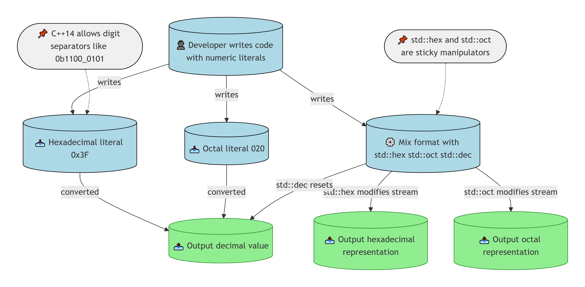
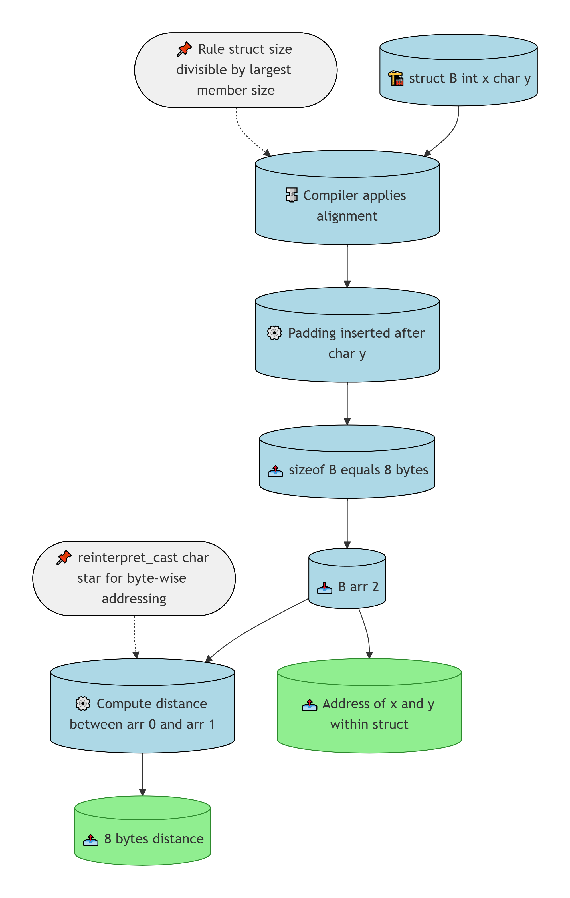
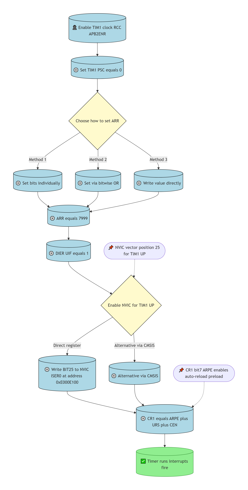
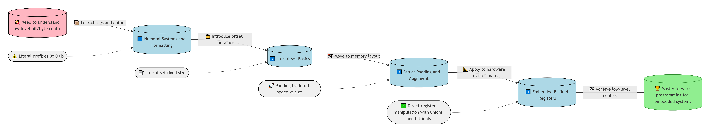

# O.1 – Bit flags and bit manipulation via std::bitset
**Hiểu sâu về bit và byte: từ hệ cơ số đến thanh ghi vi điều khiển**
File này ghi lại hành trình học tập của tôi về xử lý bit và byte trong C++ – kiến thức nền tảng cho lập trình nhúng. Từ việc làm quen với các hệ cơ số, thao tác `std::bitset`, hiểu cấu trúc struct padding, cho đến cách sử dụng bitfield để điều khiển thanh ghi vi điều khiển STM32.

## BỐI CẢNH HỌC

### Nguồn học
☑ [O.1 — Bit flags and bit manipulation via std::bitset](https://www.learncpp.com/cpp-tutorial/bit-flags-and-bit-manipulation-via-stdbitset/)

### Các bài liên quan
- ☑ [5.3 — Numeral systems (decimal, binary, hexadecimal, and octal)] – binary, hex, octal, std::bitset – đã làm được: xuất định dạng, dùng reinterpret_cast, std::bitset – nắm 95% – liên quan 10/10
- ☑ [1.4 — Variable assignment and initialization] – khởi tạo object, aggregate initialization, zero-initialization – nắm 50% – liên quan 7/10
- ☑ [13.2 — Unscoped enumerations] – unscoped enum, user-defined type – đã làm: thao tác bit trong enum – nắm 90% – liên quan 8/10
- ☐ [5.7 — Introduction to std::string] – string, std::getline – nắm 5% – liên quan 2/10

### Mục tiêu và phương hướng
- **Chuyên ngành / lĩnh vực:** Lập trình nhúng (embedded), firmware, Linux embedded, vi điều khiển bare-metal, OOP/C++
- **Thiết bị / công nghệ:** STM32F103C8T6, ESP32-S3/C3, Raspberry Pi 4; ngôn ngữ: C, C++, Python
- **Mục đích:** Học tập bổ sung kiến thức lý thuyết (3.3.2) – làm nền tảng cho nhúng

### Mức độ hoàn thành file code
- ✓ [bitset.cpp] – followed 100% – tự làm 100% – mô tả: in ra giá trị theo định dạng mong muốn
- ⚪ [bitset-member_functions.cpp] – followed 100% – tự làm 30% – mô tả: dùng size(), count(), all(), any(), none()
- ✓ [test_struct_size.cpp] – followed 100% – tự làm 100% – mô tả: tương tác bitfield, uint8_t/uint64_t/uintptr_t, reinterpret_cast, padding alignment
- ✓ [test-hexadecimal.cpp] – followed 100% – tự làm 100% – in biến dưới hex
- ✓ [test-mixed-format.cpp] – followed 100% – tự làm 85% – mở rộng thêm các tính năng nhờ AI
- ✓ [test-octal.cpp] – followed 100% – tự làm 100% – in giá trị dưới octal

### 2.1. Sợi chỉ đỏ kết nối tất cả các file
Tất cả các file đều xoay quanh việc thao tác dữ liệu ở cấp độ bit và byte – từ cách biểu diễn số, dùng bitset, hiểu bộ nhớ struct, cho đến ứng dụng trực tiếp trong thanh ghi vi điều khiển.

### 2.2. Bảng tổng quan

| Nhóm | File | Kỹ thuật chính |
|------|------|----------------|
| Hệ cơ số | test-hexadecimal, test-octal, test-mixed-format | Literal prefix (0x, 0, 0b), std::hex/oct/dec manipulator |
| std::bitset | bitset, bitset-member_functions | Khởi tạo bitset, các member function (size, count, all, any, none) |
| Struct & alignment | test_struct_size | padding, alignment, reinterpret_cast, tính khoảng cách địa chỉ |
| Bitfield embedded | advanced_timer.h, main(10.1).txt | Định nghĩa thanh ghi với bitfield, truy cập bit trực tiếp, cấu hình timer, NVIC |

### 2.3. Liên hệ thực tế với phần cứng
Kiến thức về bit và byte được ứng dụng trực tiếp trong lập trình vi điều khiển STM32, ESP32. Cấu trúc thanh ghi trong `advanced_timer.h` dùng bitfield để ánh xạ các bit trong thanh ghi TIM1 – cách làm phổ biến trong các thư viện nhúng.

## PHẦN 1: KHÁI NIỆM CỐT LÕI

### 3.1. Những điểm còn thiếu / cần bổ sung
Tôi còn yếu về bitwise operator, phụ thuộc nhiều vào AI; chỉ mới học I2C, USART, TIMER, GPIO; chưa thấy mối liên hệ giữa bitwise, bare-metal với OOP, Data Structure, Design Pattern; chưa biết bắt đầu với LeetCode/Codeforces cho nhúng; tư duy lập trình yếu, ít đọc sách.

### 3.2. Bảng các điểm cần bổ sung

| Kỹ thuật / kiến thức | Mức độ hiện tại | Mục tiêu |
|---------------------|-----------------|----------|
| Bitwise operators (<<, >>, &, \|, ^, ~) | Yếu, hay dùng AI | Thành thạo viết mà không cần AI |
| Các giao thức khác (SPI, I2S, CAN) | Chưa học | Nắm được nguyên lý và viết driver |
| OOP & Design Pattern trong nhúng | Chưa áp dụng | Xây dựng code có cấu trúc, dễ bảo trì |
| LeetCode/Codeforces cho nhúng | Chưa biết chọn bài | Bắt đầu với các bài về bit manipulation, memory |

### 3.3. Liên hệ thực tế với phần cứng
Việc hiểu rõ bitfield và alignment giúp tôi cấu hình chính xác các thanh ghi timer, xử lý ngắt, và tối ưu bộ nhớ khi lập trình STM32.

## PHẦN 2: CÁC KỸ THUẬT

### 1. Nhóm kỹ thuật: Hệ cơ số và định dạng xuất

Nhóm này giới thiệu cách viết và in các số ở dạng thập lục phân, bát phân, nhị phân trong C++. Hiểu rõ literal prefix và manipulator `std::hex`, `std::oct`, `std::dec` là nền tảng để làm việc với địa chỉ bộ nhớ và thanh ghi.



> **Prompt tạo sơ đồ Hệ cơ số và định dạng xuất (dùng cho DeepSeek):**
> ` ` ` text
> graph TD
>     Dev[(👤 Developer writes code with numeric literals)]
>     HexInput[(📥 Hexadecimal literal 0x3F)]
>     OctInput[(📥 Octal literal 020)]
>     MixedFormats[(⚙️ Mix format with std::hex std::oct std::dec)]
>     PrintDecimal[(📤 Output decimal value)]
>     PrintHex[(📤 Output hexadecimal representation)]
>     PrintOctal[(📤 Output octal representation)]
> 
>     Dev -->|writes| HexInput
>     Dev -->|writes| OctInput
>     Dev -->|writes| MixedFormats
> 
>     HexInput -->|converted| PrintDecimal
>     OctInput -->|converted| PrintDecimal
>     MixedFormats -->|std::hex modifies stream| PrintHex
>     MixedFormats -->|std::oct modifies stream| PrintOctal
>     MixedFormats -->|std::dec resets| PrintDecimal
> 
>     Note1([📌 std::hex and std::oct are sticky manipulators])
>     Note1 -.-> MixedFormats
> 
>     Note2([📌 C++14 allows digit separators like 0b1100_0101])
>     Note2 -.-> HexInput
> 
>     style Dev fill:#ADD8E6,stroke:#000
>     style HexInput fill:#ADD8E6,stroke:#000
>     style OctInput fill:#ADD8E6,stroke:#000
>     style MixedFormats fill:#ADD8E6,stroke:#000
>     style PrintDecimal fill:#90EE90,stroke:#2d8a2d
>     style PrintHex fill:#90EE90,stroke:#2d8a2d
>     style PrintOctal fill:#90EE90,stroke:#2d8a2d
>     style Note1 fill:#F0F0F0,stroke:#000
>     style Note2 fill:#F0F0F0,stroke:#000
> 
>     style Dev rx:0,ry:0
>     style HexInput rx:0,ry:0
>     style OctInput rx:0,ry:0
>     style MixedFormats rx:0,ry:0
>     style PrintDecimal rx:0,ry:0
>     style PrintHex rx:0,ry:0
>     style PrintOctal rx:0,ry:0
> ` ` `

**Ví dụ thực tế:**
```cpp
// test-hexadecimal.cpp
int x{ 0x3F }; // 0x before the number means this is hexadecimal
std::cout << x << '\n';

// test-octal.cpp
int x{ 020 }; // 0 before the number means this is octal
std::cout << x << '\n';

// test-mixed-format.cpp
int x { 12 };
std::cout << x << '\n';          // decimal (by default)
std::cout << std::hex << x << '\n'; // hexadecimal
std::cout << std::oct << x << '\n'; // octal
std::cout << std::dec << x << '\n'; // return to decimal
```

**Ghi chú:**
- `std::hex`, `std::oct` thay đổi chế độ in của toàn bộ stream sau đó.
- C++14 hỗ trợ dấu nháy đơn `'` làm separator cho số nhị phân (ví dụ `0b1100'0101`).
- Các literal hexadecimal, octal, binary có thể được dùng trực tiếp trong code mà không cần hàm chuyển đổi.

---

### 2. Nhóm kỹ thuật: std::bitset cơ bản

`std::bitset` là container cố định kích thước để thao tác bit. Cung cấp các phương thức tiện lợi như `size()`, `count()`, `all()`, `any()`, `none()`.


> **Prompt tạo sơ đồ std::bitset cơ bản (dùng cho DeepSeek):**
> ` ` ` text
> graph TD
>     Dev[(👤 Developer includes bitset header)]
>     BitsetCtor[(🔧 std::bitset 8 constructor)]
>     BinaryLiteral[(📥 Binary literal 0b1100_0101)]
>     HexLiteral[(📥 Hex literal 0xC5)]
>     Temporary[(⚙️ Temporary bitset 4)]
>     Print[(📤 Output via operator)]
>     MemberFuncs[(📤 size count all any none)]
> 
>     Dev -->|creates| BitsetCtor
>     BinaryLiteral --> BitsetCtor
>     HexLiteral --> BitsetCtor
>     BitsetCtor -->|store bits| Print
>     Temporary --> Print
>     Dev -->|uses member functions| MemberFuncs
>     MemberFuncs --> Print
> 
>     Note1([📌 std::bitset size is fixed at compile time])
>     Note1 -.-> BitsetCtor
> 
>     Note2([📌 all any none are C++11 and later])
>     Note2 -.-> MemberFuncs
> 
>     style Dev fill:#ADD8E6,stroke:#000
>     style BitsetCtor fill:#ADD8E6,stroke:#000
>     style BinaryLiteral fill:#ADD8E6,stroke:#000
>     style HexLiteral fill:#ADD8E6,stroke:#000
>     style Temporary fill:#ADD8E6,stroke:#000
>     style Print fill:#90EE90,stroke:#2d8a2d
>     style MemberFuncs fill:#ADD8E6,stroke:#000
>     style Note1 fill:#F0F0F0,stroke:#000
>     style Note2 fill:#F0F0F0,stroke:#000
> 
>     style Dev rx:0,ry:0
>     style BitsetCtor rx:0,ry:0
>     style BinaryLiteral rx:0,ry:0
>     style HexLiteral rx:0,ry:0
>     style Temporary rx:0,ry:0
>     style Print rx:0,ry:0
>     style MemberFuncs rx:0,ry:0
> ` ` `

**Ví dụ thực tế:**
```cpp
// bitset.cpp
std::bitset<8> bin1{ 0b1100'0101 };
std::bitset<8> bin2{ 0xC5 };
std::cout << bin1 << '\n' << bin2 << '\n';
std::cout << std::bitset<4>{ 0b1010 } << '\n';

// bitset-member_functions.cpp
std::bitset<8> bits{ 0b0000'1101 };
std::cout << bits.size() << " bits are in the bitset\n";
std::cout << bits.count() << " bits are set to true\n";
std::cout << std::boolalpha;
std::cout << "All bits are true: " << bits.all() << '\n';
std::cout << "Some bits are true: " << bits.any() << '\n';
std::cout << "No bits are true: " << bits.none() << '\n';
```

**Ghi chú:**
- `size()` trả về số bit (hằng số template).
- `count()` trả về số bit được set.
- Các hàm `all()`, `any()`, `none()` hữu ích để kiểm tra trạng thái bitset.

---

### 3. Nhóm kỹ thuật: Struct Padding và Alignment

Trình biên dịch có thể thêm padding vào struct để tối ưu tốc độ truy cập bộ nhớ. Kích thước struct phải chia hết cho kích thước thành viên lớn nhất. Hiểu điều này giúp dự đoán bộ nhớ và làm việc với dữ liệu nhúng.



> **Prompt tạo sơ đồ Struct Padding và Alignment (dùng cho DeepSeek):**
> ` ` ` text
> graph TD
>     StructDef[(🏗️ struct B int x char y)]
>     Compiler[(🔩 Compiler applies alignment)]
>     PaddingAdded[(⚙️ Padding inserted after char y)]
>     SizeCalc[(📤 sizeof B equals 8 bytes)]
>     ArrayTwo[(📥 B arr 2)]
>     AddressCalc[(⚙️ Compute distance between arr 0 and arr 1)]
>     Distance[(📤 8 bytes distance)]
>     MemberAddress[(📤 Address of x and y within struct)]
> 
>     StructDef --> Compiler
>     Compiler --> PaddingAdded
>     PaddingAdded --> SizeCalc
>     SizeCalc --> ArrayTwo
>     ArrayTwo --> AddressCalc
>     AddressCalc --> Distance
>     ArrayTwo --> MemberAddress
> 
>     Note1([📌 Rule struct size divisible by largest member size])
>     Note1 -.-> Compiler
> 
>     Note2([📌 reinterpret_cast char star for byte-wise addressing])
>     Note2 -.-> AddressCalc
> 
>     style StructDef fill:#ADD8E6,stroke:#000
>     style Compiler fill:#ADD8E6,stroke:#000
>     style PaddingAdded fill:#ADD8E6,stroke:#000
>     style SizeCalc fill:#ADD8E6,stroke:#000
>     style ArrayTwo fill:#ADD8E6,stroke:#000
>     style AddressCalc fill:#ADD8E6,stroke:#000
>     style Distance fill:#90EE90,stroke:#2d8a2d
>     style MemberAddress fill:#90EE90,stroke:#2d8a2d
>     style Note1 fill:#F0F0F0,stroke:#000
>     style Note2 fill:#F0F0F0,stroke:#000
> 
>     style StructDef rx:0,ry:0
>     style Compiler rx:0,ry:0
>     style PaddingAdded rx:0,ry:0
>     style SizeCalc rx:0,ry:0
>     style ArrayTwo rx:0,ry:0
>     style AddressCalc rx:0,ry:0
>     style Distance rx:0,ry:0
>     style MemberAddress rx:0,ry:0
> ` ` `

**Ví dụ thực tế:**
```cpp
// test_struct_size.cpp
struct B {
    int x;   // 4 bytes
    char y;  // 1 byte
};

// sizeof(B) = 8 do padding

// Các cách tính khoảng cách giữa arr[0] và arr[1]
std::cout << reinterpret_cast<char*>(&arr[1]) - reinterpret_cast<char*>(&arr[0]) << " bytes\n";
std::cout << (char*)(&arr[1]) - (char*)(&arr[0]) << " bytes\n";
std::cout << (uint8_t*)(&arr[1]) - (uint8_t*)(&arr[0]) << " bytes\n";
```

**Ghi chú:**
- `reinterpret_cast<char*>` cho phép tính địa chỉ theo byte.
- `uint8_t*` cũng có kích thước 1 byte, nên cách 3 đúng.
- `uintptr_t*` sai vì nó là con trỏ 8 byte, phép trừ trả về số phần tử kiểu uintptr_t, không phải byte.

---

### 4. Nhóm kỹ thuật: Bitfield Embedded – Thanh ghi TIM1 trên STM32

Nhóm này thể hiện cách định nghĩa cấu trúc thanh ghi bằng bitfield (union/struct) để truy cập từng bit, và cách cấu hình timer, NVIC trong main.



> **Prompt tạo sơ đồ Bitfield Embedded (dùng cho DeepSeek):**
> ` ` ` text
> graph TD
>     Start[(👤 Enable TIM1 clock RCC APB2ENR)]
>     ConfigPrescaler[(⚙️ Set TIM1 PSC equals 0)]
>     ConfigAutoReload{Choose how to set ARR}
>     ConfigARRA[(⚙️ Set bits individually)]
>     ConfigARRB[(⚙️ Set via bitwise OR)]
>     ConfigARRC[(⚙️ Write value directly)]
>     SetARR[(⚙️ ARR equals 7999)]
>     EnableUIE[(⚙️ DIER UIF equals 1)]
>     EnableNVIC{Enable NVIC for TIM1 UP}
>     NVICBase[(⚙️ Write BIT25 to NVIC ISER0 at address 0xE000E100)]
>     UseCMSIS[(⚙️ Alternative via CMSIS)]
>     ConfigCR1[(⚙️ CR1 equals ARPE plus URS plus CEN)]
>     TimerRuns[(✅ Timer runs interrupts fire)]
> 
>     Start --> ConfigPrescaler
>     ConfigPrescaler --> ConfigAutoReload
>     ConfigAutoReload -->|Method 1| ConfigARRA
>     ConfigAutoReload -->|Method 2| ConfigARRB
>     ConfigAutoReload -->|Method 3| ConfigARRC
>     ConfigARRA --> SetARR
>     ConfigARRB --> SetARR
>     ConfigARRC --> SetARR
>     SetARR --> EnableUIE
>     EnableUIE --> EnableNVIC
>     EnableNVIC -->|Direct register| NVICBase
>     EnableNVIC -->|Alternative via CMSIS| UseCMSIS
>     NVICBase --> ConfigCR1
>     UseCMSIS --> ConfigCR1
>     ConfigCR1 --> TimerRuns
> 
>     Note1([📌 NVIC vector position 25 for TIM1 UP])
>     Note1 -.-> EnableNVIC
> 
>     Note2([📌 CR1 bit7 ARPE enables auto-reload preload])
>     Note2 -.-> ConfigCR1
> 
>     style Start fill:#ADD8E6,stroke:#000
>     style ConfigPrescaler fill:#ADD8E6,stroke:#000
>     style ConfigAutoReload fill:#FFFACD,stroke:#000
>     style ConfigARRA fill:#ADD8E6,stroke:#000
>     style ConfigARRB fill:#ADD8E6,stroke:#000
>     style ConfigARRC fill:#ADD8E6,stroke:#000
>     style SetARR fill:#ADD8E6,stroke:#000
>     style EnableUIE fill:#ADD8E6,stroke:#000
>     style EnableNVIC fill:#FFFACD,stroke:#000
>     style NVICBase fill:#ADD8E6,stroke:#000
>     style UseCMSIS fill:#ADD8E6,stroke:#000
>     style ConfigCR1 fill:#ADD8E6,stroke:#000
>     style TimerRuns fill:#90EE90,stroke:#2d8a2d
> ` ` `

**Ví dụ thực tế:**
```cpp
// advanced_timer.h – cấu trúc thanh ghi dùng bitfield
typedef struct {
  union {
    unsigned long REG;
    struct {
      unsigned long b0  : 1;
      unsigned long b1  : 1;
      // ...
      unsigned long _reserved : 16;
    } BITS;
  } PSC;
  // tương tự cho ARR, CCR...
} ADVANCED_TIMER_TypeDef;

// main(10.1).txt – cấu hình TIM1
RCC.APB2_ENR.BITS.TIM1 = 1;     // cấp xung
TIM1.PSC.REG = 0;                // prescaler
TIM1.ARR.REG = 7999;             // auto-reload
TIM1.DIER.BITS.UIE = 1;          // cho phép ngắt update
*((unsigned long*)0xE000E100) = BIT25; // enable NVIC cho TIM1_UP
TIM1.CR1.REG = BIT7 | BIT2 | BIT0; // ARPE, URS, CEN
```

**Ghi chú:**
- Có ba cách gán ARR: set từng bit, dùng OR các hằng số BITn, hoặc gán trực tiếp giá trị số.
- NVIC được enable bằng cách ghi trực tiếp vào thanh ghi ISER0 tại địa chỉ 0xE000E100.
- CR1 bit7 (ARPE) bật auto-reload preload, bit2 (URS) chọn nguồn yêu cầu update, bit0 (CEN) bật timer.

## PHẦN 3: SƠ ĐỒ TỔNG QUAN

Sơ đồ tổng quan kết nối các nhóm kỹ thuật lại với nhau theo lộ trình học: từ hiểu hệ cơ số, đến dùng bitset, đến hiểu bộ nhớ struct, cuối cùng áp dụng vào bitfield embedded.



> **Prompt tạo sơ đồ Tổng quan (dùng cho DeepSeek):**
> ` ` ` text
> graph LR
>     Problem[(💥 Need to understand low-level bit/byte control)]
>     V1[(1️⃣ Numeral Systems and Formatting)]
>     V2[(2️⃣ std::bitset Basics)]
>     V3[(3️⃣ Struct Padding and Alignment)]
>     V4[(4️⃣ Embedded Bitfield Registers)]
> 
>     Goal[(🏆 Master bitwise programming for embedded systems)]
> 
>     Problem -->|📦 Learn bases and output| V1
>     V1 -->|🔓 Introduce bitset container| V2
>     V2 -->|✂️ Move to memory layout| V3
>     V3 -->|📐 Apply to hardware register maps| V4
>     V4 -->|🏁 Achieve low-level control| Goal
> 
>     N1([⚠️ Literal prefixes 0x 0 0b])
>     N1 -.-> V1
> 
>     N2([📝 std::bitset fixed size])
>     N2 -.-> V2
> 
>     N3([🚀 Padding trade-off speed vs size])
>     N3 -.-> V3
> 
>     N4([✅ Direct register manipulation with unions and bitfields])
>     N4 -.-> V4
> 
>     style Problem fill:#FFB6C1,stroke:#000
>     style V1 fill:#ADD8E6,stroke:#000
>     style V2 fill:#ADD8E6,stroke:#000
>     style V3 fill:#ADD8E6,stroke:#000
>     style V4 fill:#ADD8E6,stroke:#000
>     style Goal fill:#90EE90,stroke:#2d8a2d
>     style N1 fill:#F0F0F0,stroke:#000
>     style N2 fill:#F0F0F0,stroke:#000
>     style N3 fill:#F0F0F0,stroke:#000
>     style N4 fill:#F0F0F0,stroke:#000
> ` ` `

## BẢNG TRA CỨU NHANH

| Mục tiêu | Syntax / Hàm | Ví dụ nhanh | Ghi chú |
|----------|--------------|-------------|---------|
| In số dạng hex | `std::hex` | `std::cout << std::hex << x;` | Sticky, ảnh hưởng đến các lần sau |
| Tạo bitset từ nhị phân | `std::bitset<8> b{0b1100'0101};` | `std::bitset<8> bin{0b1100'0101};` | C++14 có digit separators |
| Đếm số bit set | `std::bitset::count()` | `bits.count()` | Trả về size_t |
| Kiểm tra có bit nào set không | `std::bitset::any()` | `if(bits.any())` | `all()` và `none()` cũng có sẵn |
| Ép con trỏ để tính byte | `reinterpret_cast<char*>(&obj)` | `reinterpret_cast<char*>(&arr[1]) - reinterpret_cast<char*>(&arr[0])` | Kết quả là số byte |
| Set bit trong thanh ghi | `REG |= BITn` | `TIM1.CR1.REG \|= BIT7;` | Dùng macro BITn = (1<<n) |
| Enable NVIC trực tiếp | Ghi vào NVIC_ISERx | `*((unsigned long*)0xE000E100) = BIT25;` | ISER0 cho IRQ 0-31 |

## GHI CHÚ CÁ NHÂN

### Điều tôi chưa nắm vững
- Yếu về việc thực hiện các bitwise operator bên C đọc khá khó hiểu. Còn dùng AI để hỗ trợ code nhiều
- Chỉ mới học được giao thức I2C, USART, TIMER(PWM) và GPIO. Các giao thức khác chưa tìm hiểu qua. Còn dùng AI để code khá nhiều. Chủ yếu là hiểu được luồng làm việc bằng cách nhìn vào datasheet.
- Chưa thấy được mối liên hệ giữa việc học bitwise operator, bare-metal với kiến thức của OOP, Class, Data Structure & Algorithm, Dynamic Programming, Computer Architecture( chỉ mới biết sơ sơ về struct, bitfield, padding,...)
- Chưa tiếp cận với các kiến thức như Solid Design, Design Architecture, Design Pattern,... khiến cho việc mở rộng code trông rất rối và khó bảo trì.
- Chưa biết liệu Leetcode hay Codeforces có hỗ trợ các bài tập liên quan đến lĩnh vực lập trình nhúng này không? Vì tôi thấy nhiều người giới thiệu mà thấy bài tập quá đa dạng nên chưa biết bắt đầu từ đâu
- Tư duy lập trình còn yếu kém. Chủ yếu học từ learncpp.com bổ sung kiến thức về C++ một cách bài bản nhất. 
- Ít đọc sách về lập trình(đã từng đọc sách từ trường đại học, nhưng thấy không vào). Đã từng đọc cuốn sách 'Modern C' của Hal open source và thấy nó khá cuốn ở những chapter đầu tiên(tuy nhiên đọc xong cảm thấy học code không hiệu quả)

### Snippet code / File code tham khảo
Không có thêm.

### Bước tiếp theo / Hướng phát triển
Dựa trên các điểm yếu đã liệt kê, tôi đề xuất lộ trình:
1. **Ôn lại bitwise operators** – làm các bài tập nhỏ không dùng AI, tự viết.
2. **Đọc sách "Modern C"** tiếp tục từ chương đã đọc, tập trung vào các bài tập cuối chương.
3. **Làm quen với LeetCode bit manipulation tag** – bắt đầu với các bài dễ, tự code.
4. **Học một giao thức mới (SPI) trên STM32**, viết driver từ đầu không dùng AI.
5. **Tìm hiểu Design Pattern trong nhúng** – ví dụ: Singleton cho HAL, Observer cho ngắt.

Thanh tiến độ chung: ██░░░░░░░░ 20% (còn nhiều mảng chưa vững)

### Theo dõi tiến độ bài giảng
- ☑ [O.1 — Bit flags and bit manipulation via std::bitset](https://www.learncpp.com/cpp-tutorial/bit-flags-and-bit-manipulation-via-stdbitset/) – 100%  
  ██████████ 100%
- ☑ [5.3 — Numeral systems (decimal, binary, hexadecimal, and octal] – 95%  
  █████████░ 95%
- ☑ [1.4 — Variable assignment and initialization] – 50%  
  █████░░░░░ 50%
- ☑ [13.2 — Unscoped enumerations] – 90%  
  ████████░░ 90%
- ☐ [5.7 — Introduction to std::string] – 5%  
  ░░░░░░░░░░ 5%

### Theo dõi tiến độ file code
- ✓ [bitset.cpp] – 100%  
  ██████████ 100%
- ⚪ [bitset-member_functions.cpp] – 30%  
  ███░░░░░░░ 30%
- ✓ [test_struct_size.cpp] – 100%  
  ██████████ 100%
- ✓ [test-hexadecimal.cpp] – 100%  
  ██████████ 100%
- ✓ [test-mixed-format.cpp] – 85%  
  ████████░░ 85%
- ✓ [test-octal.cpp] – 100%  
  ██████████ 100%

### Ghi chú tự do
> 