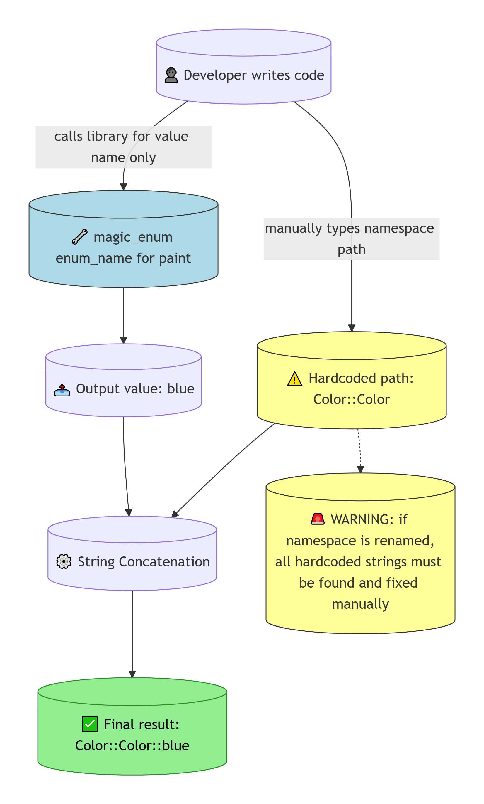
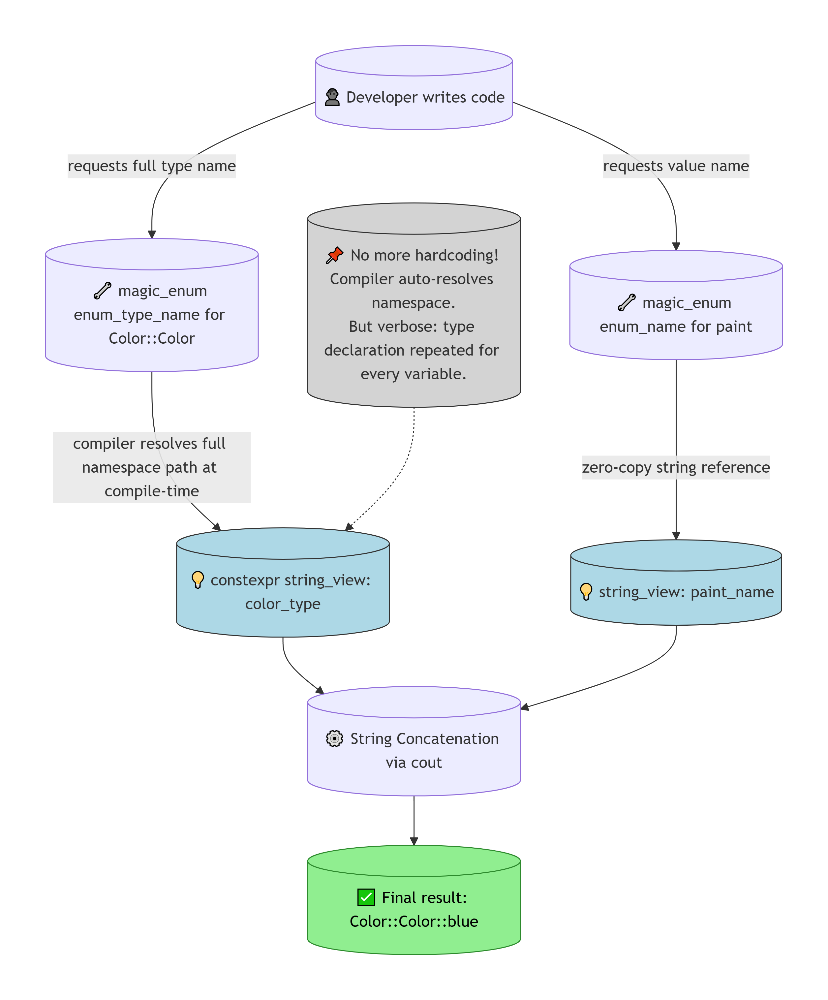
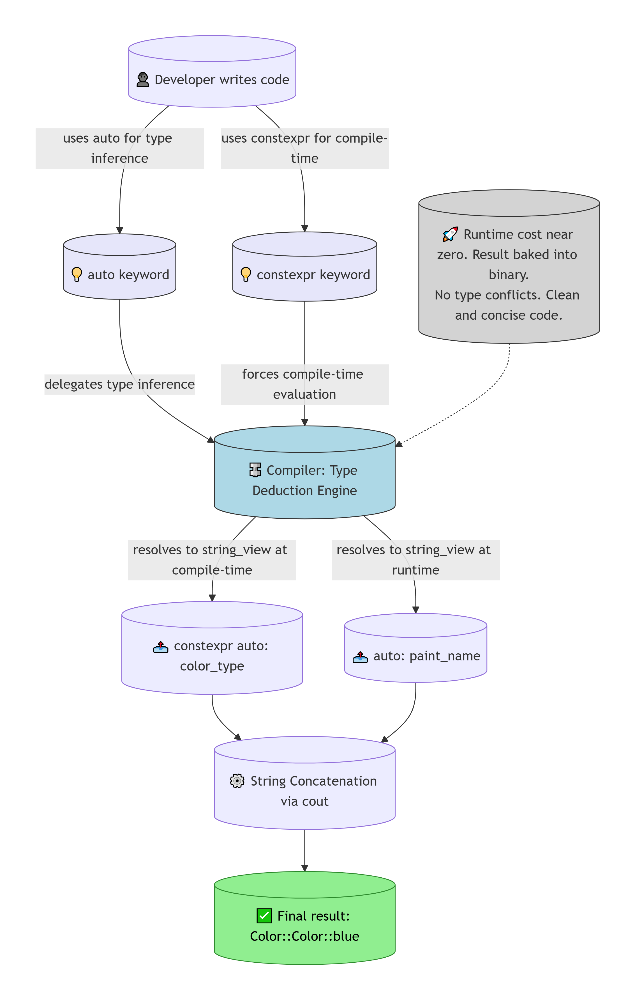
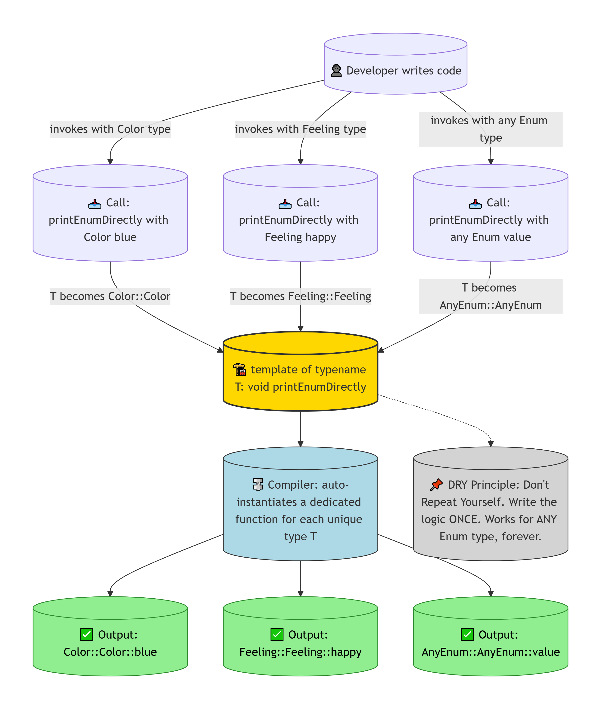
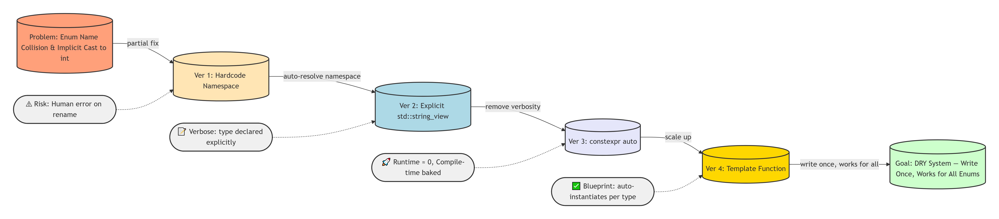

# Stage 01: Enum Architecture, Modern C++ Features & Compiler Debugging
**Tài liệu Master: Thiết kế cấu trúc Enum, Tích hợp Thư viện và Giải mã Lỗi Trình biên dịch C++**

Tài liệu này ghi chép lại toàn bộ quá trình phân tích bản chất Enum trong C++, các vấn đề đụng độ tên (Name Collision), chiến lược tích hợp thư viện `magic_enum`, và lộ trình cải tiến qua 4 phiên bản từ thủ công đến tự động hoàn toàn.
---
## Phụ lục: Chú thích hệ thống Icon
Hệ thống icon đã xác định:
Ver 1–4 (Icon trạng thái):  
⚠️ — node có rủi ro / cảnh báo  
✅ — node kết quả tốt / đầu ra  
🔧 — node kỹ thuật / xử lý  
📌 — node ghi chú / annotation  
💡 — node keyword / khái niệm  
📥 — node đầu vào / input  
📤 — node đầu ra / output  

Ver 1–4 — Icon trạng thái (mỗi sơ đồ có bộ icon riêng phù hợp với logic của nó):
| Sơ đồ | Icon đặc trưng | Lý do chọn |
|---|---|---|
| Ver 1 | 👤 dev, 🔧 lib, ⚠️ hardcode, 🚨 cảnh báo, ✅ kết quả | Nhấn mạnh rủi ro của hardcode |
| Ver 2 | 🔧 lib call, 💡 khai báo keyword, 📌 ghi chú, ✅ kết quả | Nhấn mạnh sự tường minh |
| Ver 3 | 💡 keyword, 🔩 compiler engine, 📤 output biến, 🚀 perf | Nhấn mạnh tốc độ compile-time |
| Ver 4 | 📥 call-site, 🏗️ blueprint, 🔩 compiler, ✅ output, 📌 DRY | Nhấn mạnh kiến trúc khuôn đúc |

**Chú thích cả 3 loại icon:**  
* Type A (node chính): 💥1️⃣2️⃣3️⃣4️⃣🏆 — kể câu chuyện tiến hóa
* Type B (annotation): ⚠️📝🚀✅ — đánh giá chất lượng từng bước
* Type C (edge label): 📦🔓✂️📐🏁 — mô tả bản chất của mỗi bước chuyển tiếp
---

## PHẦN 1: MỞ ĐẦU, LÝ THUYẾT, CÁC LỖI VÀ TRƯỜNG HỢP ĐÃ GẶP

### 1.1. Bản chất Enum và Vấn đề cốt lõi (Name Collision & Implicit Cast)

* **Bản chất Unscoped Enum:** Trong C++ tiêu chuẩn, Enum kiểu cũ thực chất chỉ là các hằng số nguyên (`int`).
* **Hiện tượng:** Khi in trực tiếp `Color::blue`, C++ ngầm ép kiểu (Implicit Cast) và in ra số `2` thay vì chữ `"blue"`.
* **Giải pháp tránh đụng độ:** Bọc Enum bên trong `namespace`. Điều này giúp `Color::Color::blue` tồn tại độc lập với `Feeling::Feeling::blue`, tránh hoàn toàn xung đột tên (Name Collision) ở cấp độ global.

### 1.2. Giới hạn của C++ (Lack of Reflection)

* C++ xóa sạch mọi tên biến (**Reflection metadata**) sau khi Compile để tối ưu tốc độ.
* Không thể dùng `static_cast<std::string>` để lấy lại tên chuỗi từ giá trị Enum.
* Buộc phải dùng thư viện ngoài (`magic_enum`) can thiệp qua **Template Metaprogramming** để "dịch ngược" giá trị số về tên chuỗi tại thời điểm biên dịch.

### 1.3. Nhật ký lỗi Compiler (Domino Effect)

* **Triệu chứng:** Khi `#include "magic_enum.hpp"`, Compiler Dev-C++ báo hàng ngàn lỗi như `'std::optional' has not been declared`, `'std::string_view' has not been declared`, và `'if constexpr' only available with '-std=c++17'`.
* **Nguyên nhân:** Dev-C++ mặc định đang chạy ở chuẩn cũ (C++11/14). Khi gặp cú pháp C++17, nó không hiểu và gây ra **hiệu ứng sụp đổ dây chuyền (Domino Error)** — báo lỗi ảo liên tục ở các dòng code hoàn toàn đúng.
* **Cách Fix:** Cấu hình GUI Dev-C++: `Tools` → `Compiler Options...` → `Settings` → `Code Generation` → `Language standard (-std)` → **`ISO C++17`**.

> 📝 **LƯU Ý QUAN TRỌNG:**
> Khi thấy hàng trăm lỗi xuất hiện cùng lúc sau khi thêm một `#include` duy nhất, đó gần như chắc chắn là **Domino Error** do sai chuẩn ngôn ngữ — KHÔNG phải lỗi trong code. Việc cần làm là fix chuẩn Compiler trước, không phải đọc từng dòng lỗi.

---

## PHẦN 2: CÁCH FIX, THỨ TỰ CHO 4 VERSIONS VÀ CẢI TIẾN

Sử dụng thư viện mã nguồn mở `magic_enum.hpp` (Header-only) kết hợp các tính năng của **C++17** để "dịch ngược" Enum thành chuỗi String lúc biên dịch.

---

### Ver 1: Hardcode Namespace (Nửa thủ công)



> **Prompt cho AI vẽ Sơ đồ Ver 1:**
> ```text
> Act as a Senior C++ Software Architect. Generate a Mermaid.js flowchart (Graph TD)
> illustrating Version 1 of the Enum naming solution: Hardcode Namespace.
> CRITICAL STYLE REQUIREMENT: You MUST use the database/cylinder shape syntax
> `NodeID[(Label)]` for ALL nodes to give them a 3D cylindrical look.
> 
> ICON SYSTEM — prepend an icon to every node label to show its status/role:
> - 👤 for the developer/actor node (who initiates the action)
> - 🔧 for library/tool nodes (technical processing components)
> - ⚠️ for hardcoded/risky nodes (things that could break)
> - 📤 for intermediate output nodes (data flowing through)
> - ⚙️ for processing/transformation nodes (concatenation, logic)
> - ✅ for the final successful result node
> - 🚨 for warning/risk annotation nodes
> 
> Nodes and Routing:
> 1. `Dev[(👤 Developer writes code)]` connects down to
>    `MagicEnum[(🔧 magic_enum enum_name for paint)]`
>    with the label `|calls library for value name only|`.
> 2. `Dev` ALSO connects down to `Hardcode[(⚠️ Hardcoded path: Color colon colon Color)]`
>    with the label `|manually types namespace path|`.
> 3. `MagicEnum` connects down to `Output[(📤 Output value: blue)]`.
> 4. `Hardcode` connects down to `Concat[(⚙️ String Concatenation)]`.
> 5. `Output` connects down to `Concat`.
> 6. `Concat` connects down to `Result[(✅ Final result: Color colon colon Color colon colon blue)]`.
> 7. Create a standalone warning node `Risk[(🚨 WARNING: if namespace is renamed, all hardcoded
>    strings must be found and fixed manually)]` and link it FROM `Hardcode` TO `Risk`
>    using a dashed line style: `Hardcode -.-> Risk`.
>    Do NOT connect Risk to any other node.
> 
> Please apply a yellow fill color to the `Hardcode` and `Risk` nodes.
> Apply a light blue fill to `MagicEnum`. Apply a light green fill to `Result`.
> Apply style: `classDef resultStyle fill:#90EE90,stroke:#2d8a2d,color:#000`
> and assign `class Result resultStyle`.
> ```

**Giải thích/mô tả:**

Ở phiên bản này, chúng ta chỉ dùng thư viện để lấy tên phần tử cuối (`blue`), còn gia phả `namespace::enum` vẫn phải tự gõ tay (**Hardcode**). Cách này dễ hiểu cho người mới bắt đầu, nhưng nếu sau này đổi tên namespace `Color` thành `Colors`, lập trình viên phải tự đi dò tìm và sửa lại từng dòng hardcode bằng tay. Rất dễ sinh lỗi (**Human error**).

**Snippet:**

```cpp
// Chỉ dùng magic_enum::enum_name để lấy tên phần tử, hardcode phần gia phả
std::cout << "This is '" << magic_enum::enum_name(paint) << "' from \"Color::Color::blue\"\n";
```

---

### Ver 2: Tường minh với `std::string_view`



> **Prompt cho AI vẽ Sơ đồ Ver 2:**
> ```text
> Act as a Senior C++ Software Architect. Generate a Mermaid.js flowchart (Graph TD)
> illustrating Version 2 of the Enum naming solution: Explicit std::string_view.
> CRITICAL STYLE REQUIREMENT: You MUST use the database/cylinder shape syntax
> `NodeID[(Label)]` for ALL nodes to give them a 3D cylindrical look.
> 
> ICON SYSTEM — prepend an icon to every node label to show its status/role:
> - 👤 for the developer/actor node (who initiates the action)
> - 🔧 for library/tool call nodes (magic_enum calls)
> - 💡 for keyword/type declaration nodes (constexpr, string_view declarations)
> - ⚙️ for processing/transformation nodes (concatenation, logic)
> - ✅ for the final successful result node
> - 📌 for annotation/note nodes (observations about the approach)
> 
> Nodes and Routing:
> 1. `Dev[(👤 Developer writes code)]` connects down to
>    `TypeName[(🔧 magic_enum enum_type_name for Color Color)]`
>    with the label `|requests full type name|`.
> 2. `Dev` ALSO connects down to
>    `ValueName[(🔧 magic_enum enum_name for paint)]`
>    with the label `|requests value name|`.
> 3. `TypeName` connects down to `SVType[(💡 constexpr string_view: color_type)]`
>    with the label `|compiler resolves full namespace path at compile-time|`.
> 4. `ValueName` connects down to `SVValue[(💡 string_view: paint_name)]`
>    with the label `|zero-copy string reference|`.
> 5. `SVType` connects down to `Concat[(⚙️ String Concatenation via cout)]`.
> 6. `SVValue` connects down to `Concat`.
> 7. `Concat` connects down to `Result[(✅ Final result: Color colon colon Color colon colon blue)]`.
> 8. Create a standalone note node `Note[(📌 No more hardcoding! Compiler auto-resolves namespace.
>    But verbose: type declaration repeated for every variable.)]`
>    and link it using a dashed line: `Note -.-> SVType`.
>    Do NOT connect Note to any other node.
> 
> Please apply a light blue fill to `SVType` and `SVValue`.
> Apply a light green fill to `Result`. Apply a light grey fill to `Note`.
> Apply style: `classDef resultStyle fill:#90EE90,stroke:#2d8a2d,color:#000`
> and assign `class Result resultStyle`.
> ```

**Giải thích/mô tả:**

Cải tiến từ Ver 1, ép máy tính tự động lấy toàn bộ gia phả bằng cách khai báo rõ ràng kiểu dữ liệu `std::string_view`. `std::string_view` (C++17) giúp tham chiếu chuỗi siêu tốc (**Zero-copy string referencing**) — máy tính không tạo bản sao chuỗi mới mà chỉ trỏ thẳng vào bộ nhớ có sẵn. Máy tính sẽ tự gọi `magic_enum` lôi cả gia phả ra. Code chạy siêu tốc nhưng gõ hơi mỏi tay do phải lặp lại khai báo kiểu dữ liệu dài.

**Snippet:**

```cpp
// Viết tường minh (explicit) thay vì lười biếng dùng auto:
constexpr std::string_view color_type = magic_enum::enum_type_name<Color::Color>();
std::string_view paint_name           = magic_enum::enum_name(paint);

std::cout << "This is '" << paint_name << "' from \"" << color_type << "::" << paint_name << "\"\n";
```

---

### Ver 3: Uỷ quyền thông minh với `constexpr auto`



> **Prompt cho AI vẽ Sơ đồ Ver 3:**
> ```text
>Act as a Senior C++ Software Architect. Generate a Mermaid.js flowchart (Graph TD)
>illustrating Version 3 of the Enum naming solution: constexpr auto delegation.
>CRITICAL STYLE REQUIREMENT: You MUST use the database/cylinder shape syntax
>`NodeID[(Label)]` for ALL nodes to give them a 3D cylindrical look.
>
>ICON SYSTEM — prepend an icon to every node label to show its status/role:
>- 👤 for the developer/actor node (who initiates the action)
>- 💡 for keyword nodes (auto, constexpr — language keywords being leveraged)
>- 🔩 for the compiler/engine node (internal machinery doing the work)
>- 📤 for resolved variable nodes (what the compiler produces)
>- ⚙️ for processing/transformation nodes (concatenation, logic)
>- ✅ for the final successful result node
>- 🚀 for performance annotation nodes (speed/efficiency gains)
>
>Nodes and Routing:
>1. `Dev[(👤 Developer writes code)]` connects down to
>   `Auto[(💡 auto keyword)]`
>   with the label `|uses auto for type inference|`.
>2. `Dev` ALSO connects down to `Constexpr[(💡 constexpr keyword)]`
>   with the label `|uses constexpr for compile-time|`.
>3. `Auto` connects to `Compiler[(🔩 Compiler: Type Deduction Engine)]`
>   with the label `|delegates type inference|`.
>4. `Constexpr` connects to `Compiler`
>   with the label `|forces compile-time evaluation|`.
>5. `Compiler` connects down to `TypeVar[(📤 constexpr auto: color_type)]`
>   with the label `|resolves to string_view at compile-time|`.
>6. `Compiler` connects down to `ValVar[(📤 auto: paint_name)]`
>   with the label `|resolves to string_view at runtime|`.
>7. `TypeVar` connects down to `Concat[(⚙️ String Concatenation via cout)]`.
>8. `ValVar` connects down to `Concat`.
>9. `Concat` connects down to `Result[(✅ Final result: Color colon colon Color colon colon blue)]`.
>10. Create a standalone performance note node
>    `Perf[(🚀 Runtime cost near zero. Result baked into binary.
>    No type conflicts. Clean and concise code.)]`
>    and link it using a dashed line: `Perf -.-> Compiler`.
>    Do NOT connect Perf to Result or any other node.
>
>Please apply a light purple fill to `Auto` and `Constexpr`.
>Apply a light blue fill to `Compiler`. Apply a light green fill to `Result`.
>Apply a light grey fill to `Perf`.
>Apply style: `classDef resultStyle fill:#90EE90,stroke:#2d8a2d,color:#000`
>and assign `class Result resultStyle`.
>> ```

**Giải thích/mô tả:**

Cải tiến từ Ver 2 bằng cách loại bỏ sự dài dòng. Cặp đôi hoàn hảo `constexpr auto` xuất hiện. `auto` uỷ quyền cho Compiler tự **nội suy kiểu dữ liệu**. `constexpr` ép Compiler tính toán mọi thứ ngay lúc biên dịch (**Compile-time**), kết quả được in cứng vào file chạy. Mã code gọn gàng, sạch sẽ, tốc độ Runtime gần như bằng `0` và không hề báo conflict vì `auto` tự động biến thành các kiểu dữ liệu tương ứng.

**Snippet:**

```cpp
// Cách mới: Máy tính tự nội suy tên Gia phả và tên Phần tử
constexpr auto color_type = magic_enum::enum_type_name<Color::Color>();
auto paint_name            = magic_enum::enum_name(paint);

std::cout << "This is '" << paint_name << "' from \"" << color_type << "::" << paint_name << "\"\n";
```

---

### Ver 4: Hàm Khuôn đúc tự động (Template Function)



> **Prompt cho AI vẽ Sơ đồ Ver 4:**
> ```text
> Act as a Senior C++ Software Architect. Generate a Mermaid.js flowchart (Graph TD)
> illustrating Version 4 of the Enum naming solution: Template Function Blueprint.
> 
> CRITICAL STYLE REQUIREMENT: You MUST use the database/cylinder shape syntax
> `NodeID[(Label)]` for ALL nodes without exception.
> CRITICAL SHAPE FIX: After declaring all nodes, you MUST add these explicit style
> overrides to force ALL nodes back to cylinder shape, because Mermaid may auto-convert
> nodes that receive multiple arrows into rectangle shapes:
>   style Blueprint rx:0,ry:0
>   style CallA rx:0,ry:0
>   style CallB rx:0,ry:0
>   style CallC rx:0,ry:0
> This ensures every node keeps its cylinder appearance regardless of connection count.
> Do NOT add any parentheses inside node labels — the cylinder syntax `NodeID[(Label text)]`
> already provides the correct shape. Write label text directly with no extra brackets.
> 
> ICON SYSTEM — prepend an icon to every node label to show its status/role:
> - 👤 for the developer/actor node (who initiates the action)
> - 📥 for call-site nodes (where the function gets called from)
> - 🏗️ for the blueprint/template node (the reusable mold)
> - 🔩 for the compiler instantiation node (compiler doing the heavy work)
> - ✅ for each final output result node (one per instantiated type)
> - 📌 for the DRY principle annotation node
> 
> Nodes and Routing:
> 1. `Dev[(👤 Developer writes code)]` connects down to
>    `CallA[(📥 Call: printEnumDirectly with Color blue)]`
>    with the label `|invokes with Color type|`.
> 2. `Dev` ALSO connects down to
>    `CallB[(📥 Call: printEnumDirectly with Feeling happy)]`
>    with the label `|invokes with Feeling type|`.
> 3. `Dev` ALSO connects down to
>    `CallC[(📥 Call: printEnumDirectly with any Enum value)]`
>    with the label `|invokes with any Enum type|`.
> 4. `CallA` connects down to
>    `Blueprint[(🏗️ template of typename T: void printEnumDirectly)]`
>    with the label `|T becomes Color Color|`.
> 5. `CallB` connects down to `Blueprint`
>    with the label `|T becomes Feeling Feeling|`.
> 6. `CallC` connects down to `Blueprint`
>    with the label `|T becomes AnyEnum AnyEnum|`.
> 7. `Blueprint` connects down to
>    `Instantiate[(🔩 Compiler: auto-instantiates a dedicated function for each unique type T)]`.
> 8. `Instantiate` connects down to
>    `ResultA[(✅ Output: Color colon colon Color colon colon blue)]`.
> 9. `Instantiate` connects down to
>    `ResultB[(✅ Output: Feeling colon colon Feeling colon colon happy)]`.
> 10. `Instantiate` connects down to
>     `ResultC[(✅ Output: AnyEnum colon colon AnyEnum colon colon value)]`.
> 11. Create a standalone note node
>     `DRY[(📌 DRY Principle: Don't Repeat Yourself.
>     Write the logic ONCE. Works for ANY Enum type, forever.)]`
>     and link it using a dashed line: `Blueprint -.-> DRY`.
>     Do NOT connect DRY to any other node.
> 
> Please apply a gold fill to `Blueprint`. Apply a light blue fill to `Instantiate`.
> Apply a light green fill to `ResultA`, `ResultB`, `ResultC`.
> Apply a light grey fill to `DRY`.
> Apply style: `classDef resultStyle fill:#90EE90,stroke:#2d8a2d,color:#000`
> and assign `class ResultA resultStyle` and `class ResultB resultStyle`
> and `class ResultC resultStyle`.
> ```

**Giải thích/mô tả:**

**Hệ thống mở rộng (Scale-up System).** Giải quyết bài toán in hàng trăm Enum mà không cần lặp lại biến `auto` hay lệnh in `cout`. Cấu trúc `template <typename T>` biến hàm này thành một cái **khuôn đúc (Blueprint)**. Khi gọi `printEnumDirectly(Feeling::happy)`, Compiler tự động lấy khuôn này đúc ra một hàm riêng biệt hoàn toàn cho `Feeling::Feeling`. Đạt cảnh giới **DRY (Don't Repeat Yourself)** của thiết kế phần mềm chuyên nghiệp.

**Snippet:**

```cpp
// Khuôn đúc (Blueprint) nhận mọi kiểu dữ liệu T
template <typename T>
void printEnumDirectly(T myEnum) {
    constexpr auto type_name = magic_enum::enum_type_name<T>();
    auto value_name          = magic_enum::enum_name(myEnum);
    
    // Sử dụng Ký tự thoát (Escape Character) \" để in dấu ngoặc kép
    std::cout << "This is '" << value_name << "' from \"" 
              << type_name << "::" << value_name << "\"\n";
}

// Cách dùng — gọn gàng, không lặp lại logic:
printEnumDirectly(Color::Color::blue);
printEnumDirectly(Feeling::Feeling::happy);
```

---

### Summary: Tổng hợp và Đánh giá



> **Prompt cho AI vẽ Sơ đồ Summary:**
> ```text
> Act as a Senior C++ Software Architect. Generate a Mermaid.js flowchart (Graph LR)
> illustrating the full evolution journey across all 4 Versions of the Enum naming solution.
> 
> CRITICAL STYLE REQUIREMENTS:
> - Use the database/cylinder shape syntax `NodeID[(Label)]` for Problem, V1, V2, V3, V4, Goal (main evolution nodes).
> - Use the pill shape (rounded rectangle) syntax `NodeID([Label])` for annotation nodes N1, N2, N3, N4 (⚠️ 📝 🚀 ✅ nodes).
> 
> ICON SYSTEM — THREE combined icon types for maximum clarity:
> 
> TYPE A - Stage numbering on the 4 main Ver nodes:
> Use the emoji number icons 1️⃣ 2️⃣ 3️⃣ 4️⃣ at the START of each Ver node label.
> Do NOT use text like [1] or (1) — use only the emoji number icons.
> Use 💥 for Problem and 🏆 for Goal — these are not numbered stages.
> 
> TYPE B - State/quality icons on annotation note nodes (dashed lines only):
> - ⚠️ for the risk/warning annotation under Ver 1
> - 📝 for the verbosity observation annotation under Ver 2
> - 🚀 for the performance gain annotation under Ver 3
> - ✅ for the DRY success annotation under Ver 4
> 
> TYPE C - Role icons embedded in the edge labels:
> - use label `|📦 partial fix|` for the arrow from Problem to Ver 1
> - use label `|🔓 auto-resolve namespace|` for the arrow from Ver 1 to Ver 2
> - use label `|✂️ remove verbosity|` for the arrow from Ver 2 to Ver 3
> - use label `|📐 scale up|` for the arrow from Ver 3 to Ver 4
> - use label `|🏁 write once, works for all|` for the arrow from Ver 4 to Goal
> 
> Nodes and Routing (left to right evolution):
> 
> 1. Problem[(💥 Problem: Enum Name Collision and Implicit Cast to int)] connects right to
>    V1[(1️⃣ Hardcode Namespace)] with the label |📦 partial fix|.
> 2. V1 connects right to V2[(2️⃣ Explicit string_view)] with the label |🔓 auto-resolve namespace|.
> 3. V2 connects right to V3[(3️⃣ constexpr auto)] with the label |✂️ remove verbosity|.
> 4. V3 connects right to V4[(4️⃣ Template Function)] with the label |📐 scale up|.
> 5. V4 connects right to Goal[(🏆 Goal: DRY System - Write Once, Works for All Enums)] with the label |🏁 write once, works for all|.
> 
> 6. Create standalone annotation node N1 using pill shape: N1([⚠️ Risk: Human error on rename])
>    and link using dashed line FROM N1 TO V1: N1 -.-> V1.
>    Do NOT connect N1 to any other node.
> 
> 7. Create standalone annotation node N2 using pill shape: N2([📝 Verbose: type declared explicitly])
>    and link using dashed line FROM N2 TO V2: N2 -.-> V2.
>    Do NOT connect N2 to any other node.
> 
> 8. Create standalone annotation node N3 using pill shape: N3([🚀 Runtime near zero, Compile-time baked])
>    and link using dashed line FROM N3 TO V3: N3 -.-> V3.
>    Do NOT connect N3 to any other node.
> 
> 9. Create standalone annotation node N4 using pill shape: N4([✅ Blueprint: auto-instantiates per type])
>    and link using dashed line FROM N4 TO V4: N4 -.-> V4.
>    Do NOT connect N4 to any other node.
> 
> Apply fill colors:
> - Red fill to Problem.
> - Yellow fill to V1. Light grey fill to N1.
> - Light blue fill to V2. Light grey fill to N2.
> - Light purple fill to V3. Light grey fill to N3.
> - Gold fill to V4. Light grey fill to N4.
> - Light green fill to Goal.
> 
> Generate the complete Mermaid code with all nodes, edges, styles, and shapes as described.
> ```

**Giải thích/mô tả:**

Sơ đồ tổng hợp này gom toàn bộ định nghĩa, tác dụng và **side effect** (tác dụng phụ) của 4 kịch bản vào một luồng tiến hóa duy nhất để tiện so sánh kiến trúc.

| Phiên bản | Kỹ thuật cốt lõi | Ưu điểm | Nhược điểm / Rủi ro |
| :--- | :--- | :--- | :--- |
| **Ver 1** 🔨 | Hardcode + `magic_enum::enum_name` | Đơn giản, dễ đọc, dễ hiểu | Dễ sinh lỗi khi đổi tên namespace — phải sửa tay |
| **Ver 2** 🔬 | `constexpr std::string_view` tường minh | Tự động lấy gia phả, Zero-copy, tốc độ cao | Khai báo kiểu dữ liệu dài dòng, lặp lại |
| **Ver 3** ⚡ | `constexpr auto` | Gọn gàng, Compile-time, Runtime ≈ 0, không conflict | — |
| **Ver 4** 🏗️ | `template <typename T>` | DRY tuyệt đối, Scale-up vô hạn, tái sử dụng hoàn toàn | Cần hiểu Template để đọc và debug |

> 📝 **KẾT LUẬN:**
> Việc nắm vững cả 4 phiên bản giúp lập trình viên hiểu rõ sự tiến hóa của C++ hiện đại: từ việc fix lỗi đụng độ tên thủ công (**Ver 1** 🔨) cho đến việc xây dựng hệ thống tự động hoàn toàn (**Ver 4** 🏗️). Trong thực tế, **Ver 3** ⚡ là lựa chọn tối ưu cho file nhỏ, còn **Ver 4** 🏗️ là chuẩn chuyên nghiệp khi dự án mở rộng với nhiều kiểu Enum.


