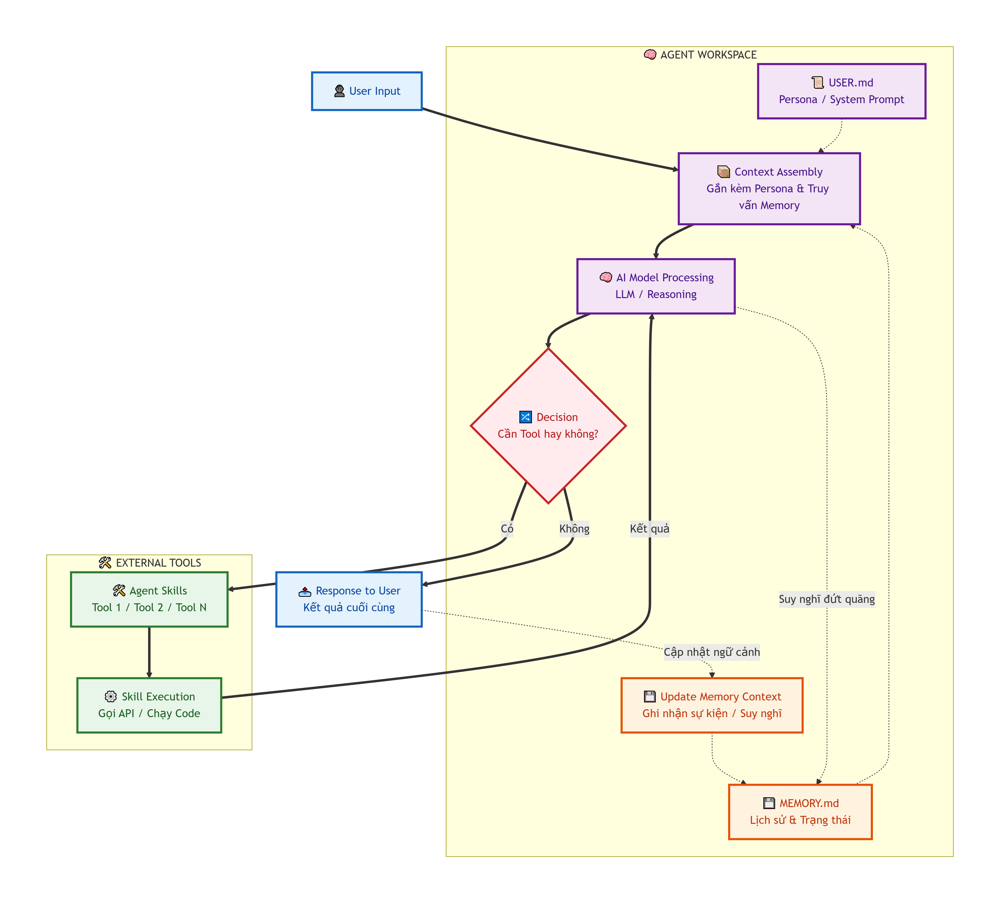
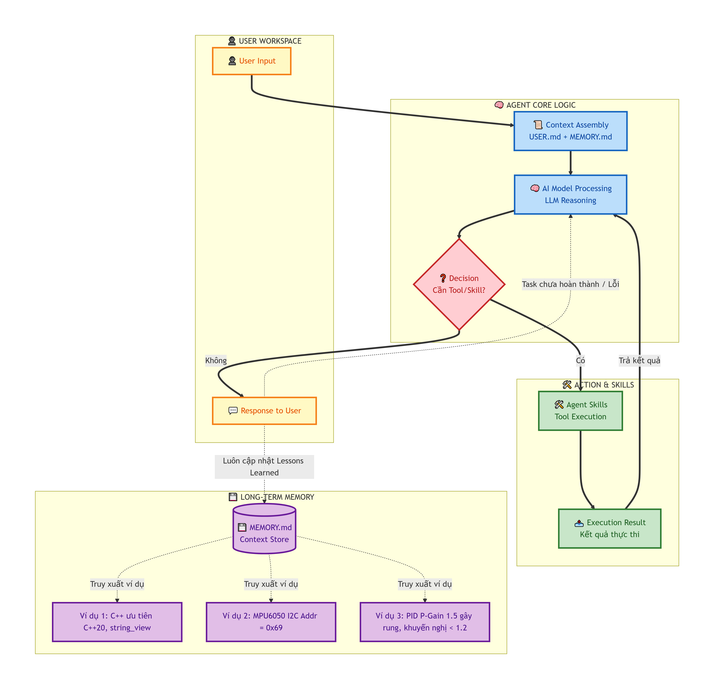

# Hermes-Agent: Toàn tập về Hệ thống Quản lý và Vận hành AI Agent

## 1. Tổng quan về Repo Hermes-Agent (NousResearch)
Hermes Agent là bộ khung (framework) mã nguồn mở mạnh mẽ, cho phép tạo ra các AI Agent có khả năng tự trị cao. Khác với Chatbot thông thường, Agent ở đây có thể tương tác trực tiếp với hệ điều hành, đọc/viết file, duyệt web và thực thi mã lệnh thông qua các kỹ năng (Skills) được định nghĩa trước.



---

## 2. Hướng dẫn cài đặt trên Windows
Đối với người dùng Windows (đặc biệt là sinh viên kỹ thuật quen dùng VMware/Ubuntu), lộ trình cài đặt ổn định nhất là thông qua môi trường Linux.

### Các bước thực hiện:
1.  **Môi trường:** Sử dụng Ubuntu (qua VMware) hoặc WSL2. Đảm bảo đã cài Python >= 3.10 và Git.
2.  **Clone Repo:**
    ```bash
    git clone [https://github.com/NousResearch/hermes-agent.git](https://github.com/NousResearch/hermes-agent.git)
    cd hermes-agent
    ```
3.  **Cài đặt thư viện:**
    ```bash
    pip install -e .
    ```
4.  **Cấu hình API Key:** Sao chép file `.env.example` thành `.env` và điền API Key (OpenAI, Anthropic hoặc OpenRouter).
5.  **Giao diện:** Chạy CLI bằng lệnh `hermes` hoặc thiết lập Web Dashboard trong thư mục `web/` (yêu cầu Node.js).

---

## 3. Các khái niệm cốt lõi & Thành phần đặc biệt

### VPS (Virtual Private Server)
-   **Khái niệm:** Máy chủ ảo chạy 24/7 trên đám mây.
-   **Liên quan đến phí 5$:** Đây là mức phí thuê VPS cơ bản (như DigitalOcean, Hetzner). Cần thiết khi bạn muốn Agent tự động trực tin nhắn (WhatsApp/Telegram) hoặc chạy tác vụ lịch trình (Cron) mà không cần bật máy cá nhân.

### Docker (Containerization)
-   **Đóng gói:** Giúp Agent chạy trong một môi trường cách ly hoàn toàn.
-   **An toàn:** Ngăn chặn Agent vô tình xóa file hệ thống của máy thật khi thực hiện các lệnh Terminal nguy hiểm.

### Agent Skills (.md)
-   ** MCP (Model Context Protocol):** Các kỹ năng được chuẩn hóa giúp AI hiểu cách dùng công cụ.
-   **Clone sẵn:** Có thể kéo các skill từ thư mục `optional-skills` hoặc từ cộng đồng GitHub MCP.
-   **Cấu trúc:** File `.md` mô tả chức năng, các tham số đầu vào và kết quả đầu ra để AI "đọc hiểu" trước khi thực thi.

### USER.md (Hoặc SOUL.md)
-   **Persona:** Định hình "linh hồn" và nguyên tắc cho AI.
-   **Ví dụ:** "Luôn code C++ chuẩn C++20, ưu tiên hiệu suất cao, không trả lời rườm rà".

### MEMORY.md (Bộ nhớ dài hạn)
-   **Lưu trữ:** Nơi Agent tự động ghi lại kinh nghiệm, cấu hình phần cứng (như thông số GPU) và các bài học từ sai lầm trước đó.
-   **Side Effect:** Giúp Agent "thông minh" dần lên sau mỗi phiên làm việc mà không cần training lại.

---

## 4. Luồng thực thi chuyên sâu & Cơ chế Cập nhật Ngữ cảnh

Cơ chế quan trọng nhất là **Agentic Workflow** và vòng lặp phản hồi khi kết quả là "KHÔNG" hoặc có lỗi.



### Cơ chế "Vòng lặp Không":
1.  **Decision (Quyết định):** Sau khi nhận Input và Context, AI Model quyết định có dùng Tool hay không.
2.  **Execution:** Thực thi Skill và trả kết quả về bộ não.
3.  **Self-Reflection (Tự đánh giá):** AI kiểm tra kết quả. Nếu Task chưa xong hoặc lỗi (Kết quả = KHÔNG) -> Nó tự tạo một prompt mới bổ sung lỗi đó và quay lại bước xử lý của Model.
4.  **Update MEMORY.md:** Cuối mỗi quá trình, Agent trích xuất thông tin quan trọng để ghi vào bộ nhớ dài hạn.

---

## 5. Đánh giá phần cứng: Local LLM vs GPU GTX 1650 (4GB VRAM)
Dựa trên thông số Card đồ họa NVIDIA GeForce GTX 1650:
-   **VRAM:** 4GB (Mức tối thiểu).
-   **Khả năng chạy Local LLM:**
    -   Các model 7B-8B (Llama 3, Qwen 7B) cần ~6GB VRAM để chạy mượt. Với 4GB, dữ liệu sẽ tràn sang RAM, tốc độ sẽ rất chậm (~1-2 token/s).
    -   **Gợi ý:** Chỉ nên chạy Local các model siêu nhỏ (1.5B - 3B) như `Qwen2.5:1.5b`. 
    -   **Khuyến nghị:** Sử dụng Cloud API (Claude 3.5, GPT-4o) để đạt hiệu quả cao nhất cho đồ án kỹ thuật.

---

## 6. Ví dụ ứng dụng thực tế (Paradigm Engineering)

### Ví dụ 1: C++ Tutorial (User Preference)
-   **Tình huống:** Bạn hỏi về xử lý chuỗi.
-   **Side Effect:** Agent nhận thấy bạn đang học C++20.
-   **Cập nhật MEMORY.md:** `User ưu tiên chuẩn C++20 và std::string_view để tối ưu bộ nhớ.`

### Ví dụ 2: Quadcopter Firmware (Hardware Debugging)
-   **Tình huống:** Lỗi giao tiếp I2C với MPU6050.
-   **Side Effect:** Debug thấy chân AD0 nối lên VCC.
-   **Cập nhật MEMORY.md:** `Địa chỉ I2C của MPU6050 trong dự án này là 0x69 (AD0=1). Không dùng 0x68.`

### Ví dụ 3: PID Tuning (Lessons Learned)
-   **Tình huống:** PID Gain gây rung máy bay.
-   **Side Effect:** AI nhận ra giới hạn thông số.
-   **Cập nhật MEMORY.md:** `Thông số P-Gain = 1.5 gây mất ổn định trục Roll. Khuyến nghị bắt đầu từ 1.2.`

---

## 7. Bảng so sánh chi phí vận hành

| Thành phần | Phiên bản Miễn phí | Phiên bản Trả phí (Khuyên dùng) |
| :--- | :--- | :--- |
| **AI Model** | Gemini 1.5 Flash (Free API), Ollama (Local) | Claude 3.5 Sonnet, GPT-4o (Pay-as-you-go) |
| **Hosting** | Chạy trên máy cá nhân (Localhost) | VPS ($5/tháng) chạy 24/7 |
| **Chất lượng** | Hay quên ngữ cảnh, code nhúng đôi khi sai thanh ghi | Rất chính xác, hiểu sâu chuẩn C++, PID, Drone |
| **Chi phí ước tính** | $0/tháng | ~$10 - $15/tháng (Token + VPS) |

### Ứng dụng cho Sale Logistic (Cảng tàu):
-   **Nền tảng:** WhatsApp/Telegram.
-   **Skill:** Tra cứu giá cước từ Database, tạo file báo giá PDF tự động.
-   **Chi phí:** VPS ($5) + Token giá rẻ (GPT-4o-mini) ~$2 = **~$7/tháng**.

---

*Ghi chú: Nội dung này được biên soạn cho Pham Minh Chien - Sinh viên Embedded Systems & IoT - DUT.*